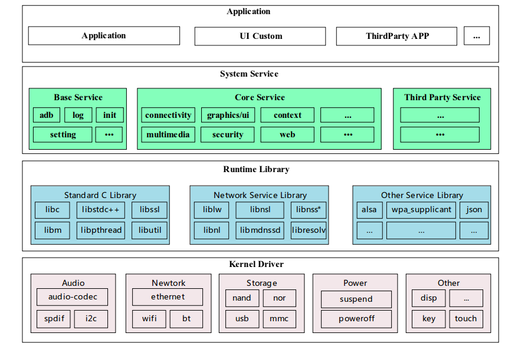
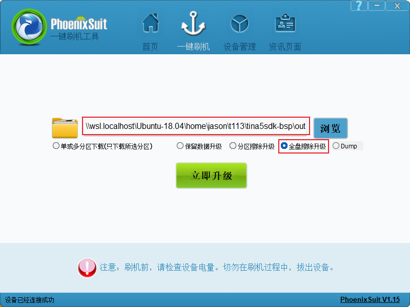
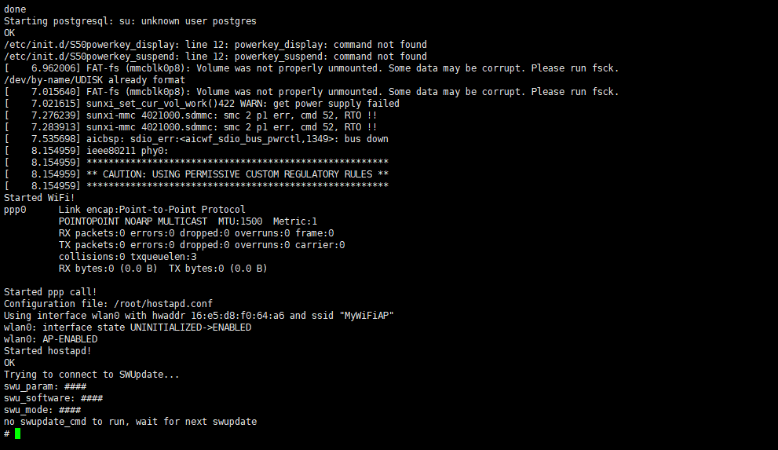

# 开发环境搭建与烧录

## 一、Tina Linux介绍

T113s3Pro-V1.3-SdNand 工业套件默认自带基于全志科技官方适配的Tina Linux v5系统。

Tina Linux是全志科技基于Linux内核开发的针对智能硬件类产品的嵌入式软件系统。Tina Linux v5.0 中包含 Linux 系统开发用到的 boot 源码、内核源码、驱动、工具、系统中间件与应用程序包。可以方便的定制、编译、打包生成Linux固件镜像。

（1）支持多构建系统
完整的SDK可以支持 openWrt 以及 buildroot，部分定制化SDK则可能只保留着 openWrt 或者 buildroot，甚至没有任何构建系统，只支持编译简单的BSP。

（2） BSP高度复用
Tina Linux v5.0 中BSP(boot,kernel代码，编译打包工具等)是独立的存在，可支持单独编译打包，快速生成一个的固件镜像。

（3）openWrt 改造
Tina Linux v5.0 对 openWrt 进行了较多改造，例如与内核编译解耦合，编译产物的目录调整，软件包及方案目录的独立仓库化等等,可以更加友好的单独构建rootfs，裁剪SDK。

*openwrt 是知名的开源嵌入式 Linux 系统自动构建框架，是由 Makefile 脚本和 Kconfig 配置文件构成的。使得用户可以通过 menuconfig配置，编译出一个完整的可以直接烧写到机器上运行的 Linux 系统软件。

### 1. 系统框图



Tina系统软件架构如图所示。从下至上分别为Kernel && Driver、Libraries、System Services、Applications 四层。

#### Kernel && Driver

Kernel&&Driver 层主要提供 Linux Kernel 的标准实现。Tina 平台的 Linux Kernel 采用 Linux3.4、Linux3.10、Linux4.4、Linux4.9、Linux5.4 等内核，不同硬件平台使用不同内核版本，提供安全性、内存管理、进程管理、网络协议栈等基础支持，并通过 Linux 内核管理设备硬件资源，如 CPU 调度、缓存、内存、I/O 等。 其中D1-H适配的是Linux 5.4内核。

#### Libraries

Libraries 层对应一般嵌入式系统，相当于中间件层次。其包含了各种系统基础库、第三方开源程序库支持，为应用层提供 API 接口，系统定制者和应用开发者可以基于 Libraries 层的API 开发新的系统服务和应用程序。

#### System Services

System Services 层对应系统服务层，包含系统启动管理、配置管理、热插拔管理、存储管理、多媒体中间件等。

#### Applications

Applications 层主要是实现具体的产品功能及交互逻辑，开发者可以开发实现自己的应用程序，提供系统各种能力给到终端用户。

### 2. SDK目录结构

Tina Linux v5.0 目录结构主要有构建工具、构建系统、配置工具、工具链、芯片配置目录、内核及boot目录等组成。

Tina Linux v5.0 内置快速跳转指令，可以快速进入相关文件夹进行编辑修改。

```bash
TinaLinux/
  ├── brandy                               # 存放boot0，uboot等代码。
  ├── build                                # 存放Tina Linux的系统构建脚本
  ├── buildroot                            # 存放buildroot相关的配置文件以及原生builroot代码
  ├── build.sh -> build/top_build.sh       # 超链接至build/top_build.sh
  ├── device                               # 存放芯片方案的配置文件
  ├── kernel                               # 存放不同版本的内核代码
  ├── openwrt                              # 存放openWrt原生代码，及软件包、芯片方案目录
  ├── out                                  # 存放编译相关的临时文件和最终镜像文件
  ├── platform                             # 存放着一些软件包源码
  ├── prebuilt                             # 存放一些预编译好的工具
  └── tools                                # 存放一些host端工具，下载打包工具
```

下面按照目录顺序与快速跳转指令做简单介绍。

#### brandy目录

brandy目录下主要存放boot0，uboot等代码。

```bash
brandy
  └── brandy-2.0
      ├── build.sh -> tools/build.sh       # 超链接
      ├── spl-pub                          # boot0仓库
      ├── tools                            # 一些工具
      └── u-boot-2018                      # u-boot 源码
```

快捷跳转命令：`cboot` `cboot0`

#### build目录

build目录存放Tina Linux的系统构建脚本，主要功能有：

1. 提供编译需要的环境变量、函数、规则。
2. 提供各目标模块的编译方法、规则。
3. 对接 openWrt, buildroot 等不同构建系统。
4. 打包生成系统固件的脚本

快捷跳转命令：`cbuild`

#### buildroot目录

buildroot 相关的配置文件以及原生 builroot 代码。

#### device 目标

devices 目录用于存放方案的配置文件，包括内核配置、env 配置、分区表配置、sys_config.fex（全志定制板级配置文件）、

board.dts（linux标准设备树文件） 等。

```bash
device
  ├── config
  │   ├── chips
  │   ├── common
  │   └── rootfs_tar
  └── product -> ./config/chips/t113
```

快捷跳转命令：`cchips`, `cconfigs`

#### kernel目录

kernel目录主要存放不同版本的内核代码。

```bash
kernel
  ├── linux-4.9
  └── linux-5.4
```

#### openwrt目录

openwrt目录存放着openWrt原生代码，及软件包、芯片方案目录。我们采用buildroot，此处不再分析。

#### out 目录

out目录用于保存编译相关的临时文件和最终镜像文件 ，编译后自动生成此目录，以编译T113-S3 Pro-V1.3方案为例说明。

```bash
out
├── kernel -> t113/kernel
├── pack_out -> t113/evb1_auto/pack_out
├── serversocket
├── t113
│   ├── evb1_auto
│   └── kernel
├── t113_linux_evb1_auto_uart0.img -> /home/jason/t113/tina5sdk-bsp/out/t113/evb1_auto/buildroot/t113_linux_evb1_auto_uart0.img
└── toolchain
    └── gcc-linaro-5.3.1-2016.05-x86_64_arm-linux-gnueabi
```

其中， - t113_linux_evb1_auto_uart0.img为最终固件包(系统镜像)，串口信息通过串口输出。若使用pack -d，则生成的固件包为xxx_card0.img，串口信息转递到tf卡座输出。

快捷跳转命令：`ctarget`, `crootfs`

## 二、编译环境配置

嵌入式产品开发流程中，通常有两个关键的步骤，编译源码与烧写固件。源码编译需要先准备 好编译环境，而固件烧写则需要厂家提供专用烧写工具。本章节主要介绍如何搭建环境来实现Tina sdk的编译和打包。

一个典型的嵌入式开发环境包括本地开发主机和目标硬件板：

- 本地开发主机作为编译服务器，需要提供linux操作环境，建立交叉编译环境，为软件开发提供 代码更新下载，代码交叉编译服务。
- 本地开发主机通过串口或USB与目标硬件板连接，可将编译后的镜像文件烧写到目标硬件板， 并调试系统或应用程序。

### 1. 编译环境要求

本文从一个WSL中全新安装的Ubuntu18.04作为开发环境，记录需要做的环境配置，日常工作用wsl或者linux物理机作为开发主机，比较贴合实际使用场景。

> 说明：此处不再累述如何在Windows10/11上安装和配置WSL，并安装Ubuntu18.04发行版，操作步骤请检索网络上的资料。

### 2. 安装开发工具

```bash
$ sudo apt-get install build-essential subversion git-core libncurses5-dev zlib1g-dev gawk flex quilt libssl-dev xsltproc libxml-parser-perl mercurial bzr ecj cvs unzip lib32z1 lib32z1-dev lib32stdc++6 libstdc++6 -y
$ sudo apt install autoconf automake bison make cmake -y
$ sudo apt install repo -y # 或者使用wget直接下载repo到本地目录，然后将目录加到环境变量中，这样也可以正常使用repo
```

> 说明：因为Ubuntu包的下载服务器在非中国大量地区，所有下载速度会很慢，甚至可能下载不了，所以建议下载前先将apt的下载源改为国内的地址，国内有多家组织提供开源镜像站，如清华、阿里等。*由衷感谢这些组织为我们提供的便利！

## 三、编译与烧写

### 1. 准备源码

在搭建好编译环境并下载好源码后，即可对源码进行编译，编译打包好后，即可将打包好的固件烧写到设备中去。本章节主要介绍编译和烧写的方法。

- 首先，在Windows上访问下面的论坛地址，打开Tina5-SDK基础包获取：[tina5.0-sdk下载地址](https://forums.100ask.net/t/topic/7393) 。

  > 通过百度网盘下载，大小约3.3G，名称为tina5sdk-bsp-50ae436fe556be2253856af283b1e094.tar.gz 下载完成后通过网络等方式拷贝到WSL系统内目录下。

  把基础包拷贝到虚拟机之后，执行以下指令，进行解压；解压后，sdk基础包的命名是`tina5sdk-bsp`：

  ```bash
  jason@ubuntu18:~$ mkdir -p ~/t113
  jason@ubuntu18:~$ cd ~/t113
  jason@ubuntu18:~/t113$ tar -xvf  tina5sdk-bsp-50ae436fe556be2253856af283b1e094.tar.gz
  ```

  以上只是获取一个Tina5-SDK的一个基础包，并 **不是完整** 的SDK源码，还需要获取执行以下几步，才可以得到一个完整的Tina5-SDK源码包。

  ```bash
  jason@ubuntu18:~/t113$ cd tina5sdk-bsp/
  jason@ubuntu18:~/t113/tina5sdk-bsp$ git clone https://e.coding.net/weidongshan/tina5/buildroot.git
  jason@ubuntu18:~/t113/tina5sdk-bsp$ git clone https://e.coding.net/weidongshan/tina5/openwrt.git
  jason@ubuntu18:~/t113/tina5sdk-bsp$ git clone https://e.coding.net/weidongshan/tina5/platform.git
  jason@ubuntu18:~/t113/tina5sdk-bsp$ ls
  README.md  brandy  build  build.sh  buildroot  device  kernel  openwrt  out  platform  prebuilt  tools
  jason@ubuntu18:~/t113/tina5sdk-bsp$ 
  ```

  出现以上文件，说明Tina5-SDK源码获取成功。

### 2. 获取补丁包

在获取补丁包之前，先删除几个目录，

```bash
jason@ubuntu18:~/t113/tina5sdk-bsp$ rm ~/t113/tina5sdk-bsp/platform/allwinner/wireless/firmware/aic8800/aic8800d80/* -rf
jason@ubuntu18:~/t113/tina5sdk-bsp$ rm ~/t113/tina5sdk-bsp/kernel/linux-5.4/drivers/net/wireless/aic8800/ -rf
jason@ubuntu18:~/t113/tina5sdk-bsp$ rm ~/t113/tina5sdk-bsp/brandy/brandy-2.0/spl-pub/* -rf
```

基于T113s3pro v1.3 Sd Nand版本开发板，百问网提供了一个扩展补丁包，执行以下指令，获取扩展支持仓库，然后加以应用。

```bash
jason@ubuntu18:~/t113/tina5sdk-bsp$ cd ../
jason@ubuntu18:~/t113$ git clone https://github.com/DongshanPI/T113S3-PRO_TinaSDK5.git
jason@ubuntu18:~/t113$ cd T113S3-PRO_TinaSDK5
jason@ubuntu18:~/t113/T113S3-PRO_TinaSDK5$ git submodule update --init
jason@ubuntu18:~/t113/T113S3-PRO_TinaSDK5$ cp ./* -rfvd ~/t113/tina5sdk-bsp
```

### 3. 开始编译

```bash
jason@ubuntu18:~$ cd ~/t113/tina5sdk-bsp
jason@ubuntu18:~/t113/tina5sdk-bsp$ rm .buildconfig
NOTE: The SDK(/home/jason/t113/tina5sdk-bsp) was successfully loaded
load openwrt... ok
Please run lunch next for openwrt.
load buildroot,bsp...ok
Invoke . build/quick.sh from your shell to add the following functions to your environment:
    croot                          - Changes directory to the top of the tree
    cbsp                           - Changes directory to the bsp
    cbsptest                       - Changes directory to the bsptest
    ckernel                        - Changes directory to the kernel
    cbrandy                        - Changes directory to the brandy
    cboot                          - Changes directory to the uboot
    cbr                            - Changes directory to the buildroot
    cchips                         - Changes directory to the board
    cconfigs                       - Changes directory to the board's config
    cbin                           - Changes directory to the board's bin
    cdts                           - Changes directory to the kernel's dts
    ckernelout                     - Changes directory to the kernel output
    cout                           - Changes directory to the product's output
    copenssl                       - Changes directory to the product's openssl-1.0.0
Usage: build.sh [args]
    build.sh                       - default build all
    build.sh bootloader            - only build bootloader
    build.sh kernel                - only build kernel
    build.sh buildroot_rootfs      - only build buildroot
    build.sh menuconfig            - edit kernel menuconfig
    build.sh saveconfig            - save kernel menuconfig
    build.sh recovery_menuconfig   - edit recovery menuconfig
    build.sh recovery_saveconfig   - save recovery menuconfig
    build.sh buildroot_menuconfig  - edit buildroot menuconfig
    build.sh buildroot_saveconfig  - save buildroot menuconfig
    build.sh clean                 - clean all
    build.sh distclean             - distclean all
    build.sh pack                  - pack firmware
    build.sh pack_debug            - pack firmware with debug info output to card0
    build.sh pack_secure           - pack firmware with secureboot
Usage: pack [args]
    pack                           - pack firmware
    pack -d                        - pack firmware with debug info output to card0
    pack -s                        - pack firmware with secureboot
    pack -sd                       - pack firmware with secureboot and debug info output to card0
```

接着执行编译指令，首次编译需要我们选择相应的单板选项。如下：

```bash
jason@ubuntu18:~/t113/tina5sdk-bsp$ ./build.sh
All available platform:
   0. android
   1. linux
Choice [android]: 1
All available linux_dev:
   0. bsp
   1. buildroot
   2. openwrt
Choice [bsp]: 1
All available ic:
   0. t113
   1. t113_i
Choice [t113]: 0
All available board:
   0. evb1_auto
Choice [evb1_auto]: 0
All available flash:
   0. default
   1. nor
Choice [default]: 0
INFO: Prepare toolchain ...
INFO: kernel defconfig: generate /home/jason/t113/tina5sdk-bsp/out/t113/kernel/build/.config by /home/jason/t113/tina5sdk-bsp/device/config/chips/t113/configs/evb1_auto/linux-5.4/config-5.4
INFO: Prepare toolchain ...
make: Entering directory '/home/jason/t113/tina5sdk-bsp/kernel/linux-5.4'
make[1]: Entering directory '/home/jason/t113/tina5sdk-bsp/out/t113/kernel/build'
...
Number of ids (unique uids + gids) 1
Number of uids 1
        root (0)
Number of gids 1
        root (0)
INFO: pack rootfs ok ...
INFO: ----------------------------------------
INFO: build Tina OK.
INFO: ----------------------------------------
```

> 说明：第一次编译可能会遇到错误，再执行一遍build.sh即可。

需要等待一段时间，编译完成后，在当前目录下，执行以下指令，进行镜像打包，

```bash
jason@ubuntu18:~/t113/tina5sdk-bsp$ ./build.sh pack
========ACTION List: mk_pack ;========
options :
INFO: packing firmware ...
INFO: /home/jason/t113/tina5sdk-bsp/out/t113/common/keys
copying tools file
copying configs file
copying product configs file
/home/jason/t113/tina5sdk-bsp/out/t113/evb1_auto/pack_out/aultls32.fex
/home/jason/t113/tina5sdk-bsp/out/t113/evb1_auto/pack_out/aultools.fex
/home/jason/t113/tina5sdk-bsp/out/t113/evb1_auto/pack_out/boot_package.cfg
...
FileLength=954000Add partion rootfs.fex ROOTFS_FEX000000
Add partion very rootfs.fex ROOTFS_FEX000000
FilePath: rootfs.fex
FileLength=d7192acAdd partion dsp0.fex DSP0_FEX00000000
Add partion very dsp0.fex DSP0_FEX00000000
FilePath: dsp0.fex
FileLength=3fc78BuildImg 0
Dragon execute image.cfg SUCCESS !
----------image is at----------

318M    /home/jason/t113/tina5sdk-bsp/out/t113/evb1_auto/buildroot/t113_linux_evb1_auto_uart0.img

pack finish
jason@ubuntu18:~/t113/tina5sdk-bsp$
```

镜像打包完成后，执行 `cout` 会进入到镜像生成的路径。

> 说明：t113_linux_evb1_auto_uart0.img文件，即是可以使用烧录工具进行烧录的镜像文件。

### 3. 烧写固件

T113s3Pro-V1.3-SdNand 工业套件是板载的SD NAND FLASH，用pack默认制作的是flash中运行的固件，符合我们的预期。

这里我们使用全志科技提供的PhoenixSuit烧录工具即可，原厂。建议开发者开发时使用该工具进行固件升级。

#### PhoenixSuit使用简介

下面主要介绍用PhoenixSuit烧写的方法，LiveSuit和PhoenixUSBpro烧写的方法类似。

PhoenixSuit下载地址：[固件烧写工具PhoenixSuit](https://www.aw-ol.com/downloads/resources/13)

同时需安装全志USB驱动，下载链接：[全志USB驱动](https://www.aw-ol.com/downloads/resources/15)

*企业开发者在安装APST的同时也会安装全志USB驱动，无需单独再安装

具体步骤如下：

（1）打开PhoenixSuit，当设备上电启动并插入USB与PC相连的时，PhoenixSuit会提示识别到设备；

（2）点击 `一键刷机-浏览`选择要烧写的固件；

（3）点击 `立即升级`，此时会通过USB给设备发送重启命令，设备会带着烧写标识重启，并在重启阶段进入烧写模式；

（4）设备重新到boot的时候会自动进行烧写，可以看到PhoenixSuit的进度条在动；

（5）烧写成功，设备重启。



> 注意：开发阶段，建议勾上全盘擦除升级。点击完成后，如果点击 **立即升级** 没有反应，这时 我们拿起已经连接好的开发板，先按住 **FEL** 烧写模式按键，之后按一下 **RESET** 系统复位键，就可以自动进入烧写模式并开始烧写。烧写时会提示烧写进度条，烧写完成后开发板会自己重启。

烧写过程中遇到的问题，请查阅百问网开发文档：[更新系统固件](https://dshanpi.100ask.org/docs/T113s3-SdNand/part1/03-1_FlashSystem)。

### 4. 烧写后进入系统

打开对应的开发板USB串口，在烧写完成后，可以看到如下界面，即烧录成功：



## 四、参考链接

- [Tina Linux v5.0介绍](https://v853.docs.aw-ol.com/study/study_1tina/)
- [T113s-Pro V1.3开发环境搭建](https://dshanpi.100ask.org/docs/T113s3-Pro/part6/DevelopmentEnvironmentSetup)
- [T113s-Pro V1.3更新系统固件](https://dshanpi.100ask.org/docs/T113s3-SdNand/part1/03-1_FlashSystem)