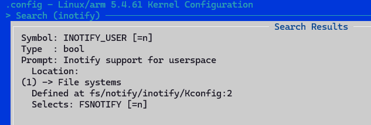
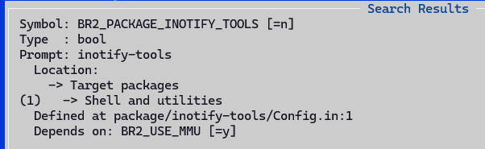
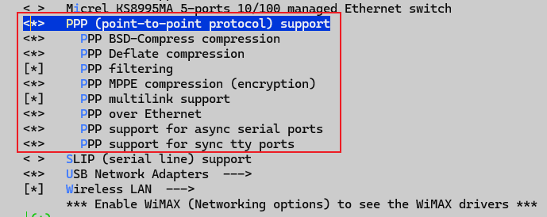
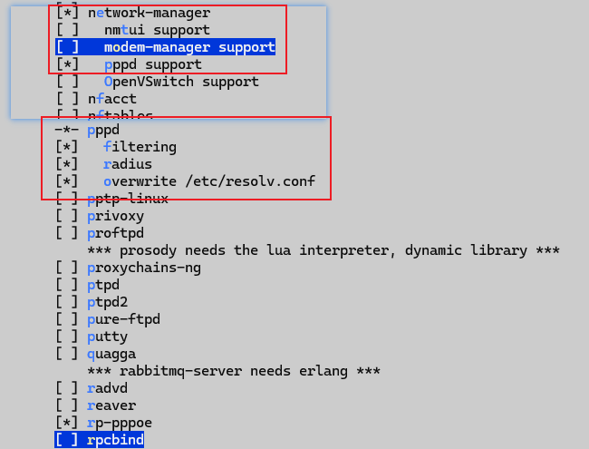
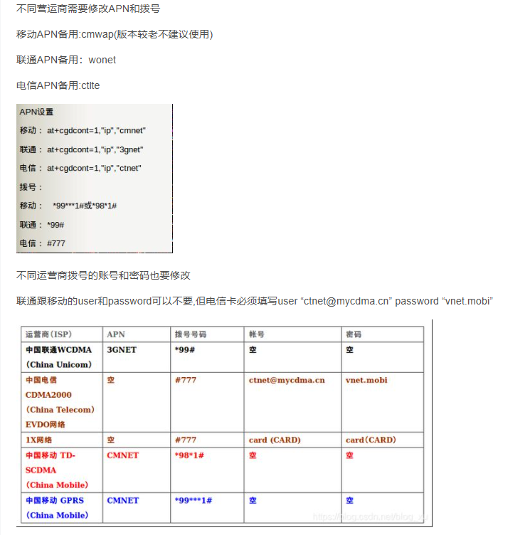

# 支持WiFi与4G模组联网

## 背景

本文基于4G模组/WiFi网络的目标，需要首先在T113s3Pro-V1.3-SdNand 工业套件上把4G模组联网，和WiFi功能支持起来，然后再去实现其他功能。

## WiFi模组适配

### WiFi模组介绍

T113s3Pro-V1.3-SdNand 工业套件，板载的AIC8800是具有双频WiFi6和BT二合一模块，。

### 模组移植适配

在百问网开发网站提供的补丁包，打入完成后，具有了WiFi模组的驱动程序。

```bash
T113S3-PRO_TinaSDK5
├── kernel
│   └── linux-5.4
│       └── drivers
│           └── net
│               └── wireless
│                   └── aic8800
│                       ├── Kconfig
│                       ├── Makefile
│                       ├── aic8800_bsp
│                       │   ├── Makefile
│                       │   ├── aic8800d80_compat.c
│                       │   ├── aic8800d80_compat.h
│                       │   ├── aic8800dc_compat.c
│                       │   ├── aic8800dc_compat.h
...
│                       └── aic8800_fdrv
│                           ├── sdio_host.h
│                           ├── usb_host.c
│                           └── usb_host.h
└── platform
    └── allwinner
        └── wireless
            └── firmware
                └── aic8800
                    └── aic8800d80
                        ├── aic_userconfig_8800d80.txt
                        ├── fmacfw_8800d80_u02.bin
                        ├── fw_adid_8800d80_u02.bin
                        ├── fw_patch_8800d80_u02.bin
                        ├── fw_patch_table_8800d80_u02.bin
                        └── lmacfw_rf_8800d80_u02.bin
```


#### 打开驱动编译支持


只需要在kernel的网络设备-无线设备下面打开AIC无线的支持即可，这个在打入百问网对xx适配的补丁包后，就已经默认打开了。

#### 模组测试

在测试前，要先加载WiFi模组的驱动程序，如下所示：

```bash
# insmod /lib/modules/5.4.61/aic8800_bsp.ko
[  203.391853] aicbsp_init
[  203.394607] RELEASE_DATE:2023_0904_1726
# insmod /lib/modules/5.4.61/aic8800_fdrv.ko
[  209.944090] AICWFDBG(LOGTRACE)	>>> rwnx_mod_init()
[  209.949624] AICWFDBG(LOGINFO)	rwnx v6.4.3.0 - - 241c091M (master)
[  209.956473] AICWFDBG(LOGINFO)	RELEASE_DATE:2023_0904_1725 
[  209.962767] AICWFDBG(LOGTRACE)	rwnx_init_cmd_array Enter 
...
[  214.498858] ieee80211 phy0: 
[  214.498858] *******************************************************
[  214.498858] ** CAUTION: USING PERMISSIVE CUSTOM REGULATORY RULES **
[  214.498858] *******************************************************
[  214.523161] AICWFDBG(LOGTRACE)	>>> rwnx_send_me_chan_config_req()
[  214.530025] AICWFDBG(LOGTRACE)	rwnx_send_msg (5123)ME_CHAN_CONFIG_CFM reqcfm:1 in_irq:0 in_softirq:0 in_atomic:0
[  214.541558] AICWFDBG(LOGTRACE)	rwnx_cmd_malloc get cmd_array[0]:127c02ad 
[  214.549705] AICWFDBG(LOGTRACE)	rwnx_cmd_free cmd_array[0]:127c02ad 
[  214.556836] AICWFDBG(LOGTRACE)	>>> rwnx_dbgfs_register()
[  214.562964] AICWFDBG(LOGINFO)	fw_log_init: c520c000, c520e800
[  214.569476] AICWFDBG(LOGINFO)	rwnx_interface_add: wlan%d, 2, 10
[  214.576375] AICWFDBG(LOGINFO)	interface add:e8 51 9e dc 7a 7f
[  215.256714] AICWFDBG(LOGINFO)	New interface create wlan0 
...
```

出现以上信息，表示WiFi驱动模块加载成功。执行 `ifconfig -a` 指令，可以看到存在 wlan0 节点。

```bash
# ifconfig wlan0
wlan0     Link encap:Ethernet  HWaddr EE:90:92:F2:D6:E2  
          UP BROADCAST MULTICAST  MTU:1500  Metric:1
          RX packets:0 errors:0 dropped:0 overruns:0 frame:0
          TX packets:0 errors:0 dropped:0 overruns:0 carrier:0
          collisions:0 txqueuelen:1000 
          RX bytes:0 (0.0 B)  TX bytes:0 (0.0 B)
```

### Wi-Fi 模组的使用

#### Wi-Fi 工作的几种模式

*目前Tina平台上的Wi-Fi一般可处于3种工作模式，分别是 STA，AP，MONITOR*。

- STATION：连接无线网络的终端，大部分无线网卡默认都处于该模式，也是常用的一种模式。
- AP：无线接入点，常称热点，比如路由器功能。
- MONITOR：也称为混杂设备监听模式，所有数据包无过滤传输到主机。

完成本评测，只使用到了AP模式，完成局域网内的终端的无线接入即可，当然该模组也是支持STATION模式，并且是双频模式（5G+2.4GHZ），但是AP模式只能使用2.4G。

> 注：与百问网开发大佬确认过，AP只能使用2.4GHz模式。

#### STA模式

这里只需要增加wpa_supplicant的配置程序，然后运行wpa_supplicant即可。配置文件示例如下：

```bash
# 在配置文件中增加连接的AP的SSID和PASSWORD
$ cat /etc/wpa_supplicant.conf
...
network={
    ssid="YourSSID"
    psk="YourPassword"
}
```

简单的使用示例：

```bash
#注意：dev=wlan0

# 加载WiFi模组驱动
insmod /lib/modules/5.4.61/aic8800_bsp.ko && insmod /lib/modules/5.4.61/aic8800_fdrv.ko
# 使能设备
printf "Starting network: "
/sbin/ifconfig $dev up
[ $? = 0 ] && echo "$dev up OK" || echo "$dev up FAIL"
# 使用wpa_supplicant连接AP
wpa_supplicant -B -Dnl80211 -i$dev -c/etc/wpa_supplicant.conf
sleep 3

# 使用udhcpc获取IP
udhcpc -i $dev -q
```

评测主要使用AP模式，这里不再过多介绍，具体的配置可以互联网搜索即可。

#### AP模式

##### 1. 安装必要的软件

您需要以下软件包：

- `hostapd`：用于创建无线接入点。
- `dnsmasq` 或其他 DHCP/DNS 服务。
- `iptables` (用于网络转发，具体视需求而定)。

##### 2. 配置 Hostapd

编辑 `hostapd` 配置文件（通常在 `/etc/hostapd/hostapd.conf`，若不存在可手动创建）：

```bash
interface=wlan0
driver=nl80211
ssid=MyWiFiAP         # 设置无线网络名称
hw_mode=g             # 模式 (a=5GHz, g=2.4GHz)
channel=6             # 信道
auth_algs=1
wpa=2
wpa_passphrase=12345678 # 设置无线密码
wpa_key_mgmt=WPA-PSK
rsn_pairwise=CCMP
```

**注意**：将 `interface=wlan0` 替换为您的无线网卡名称（可以通过 `ifconfig` 或 `ip a` 获取）。

将 `hostapd` 配置文件路径写入默认文件中：

```bash
sudo nano /etc/default/hostapd
# 将以下内容添加/修改：
DAEMON_CONF="/etc/hostapd/hostapd.conf"
```

##### 3. 配置 DHCP/DNS 服务

编辑 `dnsmasq` 配置文件：

```bash
sudo nano /etc/dnsmasq.conf
# 添加如下内容：
interface=wlan0
dhcp-range=192.168.10.10,192.168.10.100,255.255.255.0,24h
```

运行报错：

```bash
# dnsmasq -C /etc/dnsmasq.conf

dnsmasq: failed to create inotify: Function not implemented
```

需要按照如下示例打开inotify支持：

- kernel部分



- 用户层部分



##### 4. 启用网络转发

编辑 `/etc/sysctl.conf`：

```bash
sudo nano /etc/sysctl.conf
# 取消注释或添加以下行：
# net.ipv4.ip_forward=1
sudo sysctl -p

# 或者每次启动，动态设置
echo 1 > /proc/sys/net/ipv4/ip_forward
```

配置 `iptables` 规则，将流量从无线接口转发到有线接口：

```bash
echo 1 > /proc/sys/net/ipv4/ip_forward
# 这里测试使用eth0作为WAN，这里需要根据实际的网络出口接口填写
sudo iptables -t nat -A POSTROUTING -o eth0 -j MASQUERADE
```

##### 5. 测试连接

```bash
# ifconfig wlan0 192.168.10.1 netmask 255.255.255.0
ip addr add 192.168.10.1/24 dev wlan0
ip route add 192.168.10.0/24 dev wlan0

#这里打开hostapd创建无线连接，然后使用dnsmasq在ap接口开启dhcp服务，为连接上的station分配IP
dnsmasq -C /root/dnsmasq.conf
hostapd -B hostapd.conf
```

## 4G模组适配

### 4G模组介绍

EC20-CE Mini PCIe是一款支持PCI Express Mini Card 标准接口的LTE模块。采用LTE 3GPP Release 11 技术，支持最大下行速率150 Mbps和最大上行速率50 Mbps；同时在封装上兼容移远通信多网络制式LTE Cat 4 EG25-G Mini PCIe 模块，实现了从3G网络向4G网络的轻松平滑过渡。EC20-CE Mini PCIe模块能够向后兼容现存的EDGE和GSM/GPRS网络，以确保在缺乏3G和4G网络的偏远地区也能正常工作。

对于嵌入式Linux而言，大多数的4G模块接口都是MiniPCIE接口，但是深入了解一下就会发现，4G模块的通信接口都是USB，所以4G模块的驱动就是USB驱动，只要USB驱动正常，4G模块在硬件上就能正常通信。

默认kernel配置中是打开了USB驱动支持的，不用再进行额外配置，启动后会出现4个交互的串口，具体配置见下面的章节。

### 支持4G模组联网

模组接入后在系统下有4个交互的USB串口，如下：

```bash
$ ls -al /dev/ttyUSB*
crw-rw----    1 root     root      188,   0 Jan  1 01:27 /dev/ttyUSB0
crw-rw----    1 root     root      188,   1 Jan  1 01:27 /dev/ttyUSB1
crw-rw----    1 root     root      188,   2 Jan  1 01:29 /dev/ttyUSB2
crw-rw----    1 root     root      188,   3 Jan  1 01:27 /dev/ttyUSB3
```

由文档Quectel_WCDMA&LTE_Linux_USB_Driver_User_Guide_V1.8.pdf


由上可知，ttyUSB2是用来发送AT指令的，ttyUSB3是用来发送ppp的。可以先简单的使用AT测试命令，判断模组是否正常工作，示例如下：


#### 1. kernel配置

- ```./build.sh menuconfig```
- 按照下图选择对应的选项



- ```./build.sh savemenuconfig```

#### 2. buildroot配置

- `./build.sh buildroot_menuconfig`

- 按照下图选择对应的选项



- `./build.sh buildroot_saveconfig`

#### 3. 系统内配置

##### 3.1. 新建gprs-connect-chat文件

```bash
# cat /etc/ppp/gprs-connect-chat
#Chat script for China Mobile, used SIMCOM sim4100 TD module.
TIMEOUT 15
ABORT "DELAYED"
ABORT "BUSY"
ABORT "ERROR"
ABORT "NO DIALTONE"
ABORT "NO CARRIER"
TIMEOUT 40
'' \rAT
OK ATS0=0
OK ATE0V1

# use "CMNET" if china mobile; use "3GNET" if china unicom;
# use 
OK AT+CGDCONT=1,"IP","CMNET"

OK AT+CGEQREQ=1,2,128,384,,,0,,,,,,
OK ATDT*99*1#
CONNECT
```

##### 3.2. 新建gprsdial脚本

```bash
# cat /etc/ppp/peers/gprsdial
# This is pppd script for China Mobile, used SIMCOM SIM7100 Module
# Usage: root>pppd call gprs
#Interface should be used is the interface which connects physics interface of S
/dev/ttyUSB3
115200
crtscts
modem
#noauth
debug
nodetach
#hide-password
usepeerdns
noipdefault
defaultroute
user "cmnet"
0.0.0.0:0.0.0.0
#ipcp-accept-local
#ipcp-accept-remote
#lcp-echo-failure 12
#lcp-echo-interval 3
#noccp
#novj
#novjccomp
#persist
connect '/usr/sbin/chat -s -v -f /etc/ppp/gprs-connect-chat'
#disconnect '/bin/chat -v -f /etc/ppp/gprs-disconnect-chat'
```

##### 3.3. 执行pppd拨号测试

开发板连接好4G模块后使用如下指令进行拨号上网，系统内默认支持的指令为中国联通，如果你使用的是并非是联通卡，请修改`/etc/ppp/gprs-connect-chat `文件内容为你SIM卡运营商的拨号上网指令，然后执行下面命令。

```bash
pppd call gprsdial > /dev/null &2>1
```

执行后如果有类似如下打印信息，表明4G模块拨号联网成功。

```bash
sent [IPCP ConfNak id=0x6 <addr 0.0.0.0>]
rcvd [IPCP ConfRej id=0x1 <compress VJ 0f 01>]
sent [IPCP ConfReq id=0x2 <addr 0.0.0.0> <ms-dns1 0.0.0.0> <ms-dns2 0.0.0.0>]
rcvd [IPCP ConfReq id=0x7]
sent [IPCP ConfAck id=0x7]
rcvd [IPCP ConfNak id=0x2 <addr 10.109.36.245> <ms-dns1 223.87.253.100> <ms-dns2 223.87.253.253>]
sent [IPCP ConfReq id=0x3 <addr 10.109.36.245> <ms-dns1 223.87.253.100> <ms-dns2 223.87.253.253>]
rcvd [IPCP ConfAck id=0x3 <addr 10.109.36.245> <ms-dns1 223.87.253.100> <ms-dns2 223.87.253.253>]
Could not determine remote IP address: defaulting to 10.64.64.64
local  IP address 10.109.36.245
remote IP address 10.64.64.64
primary   DNS address 223.87.253.100
secondary DNS address 223.87.253.253
```

这个时候观察网络接口，会有一个新的接口ppp0，如下所示

```bash
# ifconfig
lo        Link encap:Local Loopback
          inet addr:127.0.0.1  Mask:255.0.0.0
          inet6 addr: ::1/128 Scope:Host
          UP LOOPBACK RUNNING  MTU:65536  Metric:1
          RX packets:0 errors:0 dropped:0 overruns:0 frame:0
          TX packets:0 errors:0 dropped:0 overruns:0 carrier:0
          collisions:0 txqueuelen:1000
          RX bytes:0 (0.0 B)  TX bytes:0 (0.0 B)

ppp0      Link encap:Point-to-Point Protocol
          inet addr:10.109.36.245  P-t-P:10.64.64.64  Mask:255.255.255.255
          UP POINTOPOINT RUNNING NOARP MULTICAST  MTU:1500  Metric:1
          RX packets:5 errors:0 dropped:0 overruns:0 frame:0
          TX packets:6 errors:0 dropped:0 overruns:0 carrier:0
          collisions:0 txqueuelen:3
          RX bytes:62 (62.0 B)  TX bytes:101 (101.0 B)
```

##### 3.4. 不同运营商APN和拨号配置



## 参考资料

- [pppoe拨号上网-百问网wiki](http://wiki.100ask.net/How_to_use_pppd_to_dial_up_the_Internet_for_supporting_4G_modules#.E4.BD.BF.E7.94.A8.E7.A7.BB.E8.BF.9CEC20_4G.E6.A8.A1.E5.9D.97)