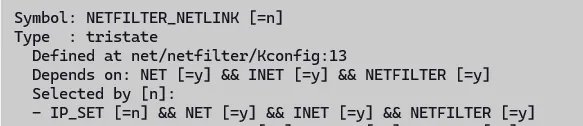

# 支持网络透传

## 网络透传的含义

网络透传是指数据在网络中传输时，保持其原始格式和内容不变，不进行任何修改或处理。以下是其关键点：

1. **定义** 
数据从发送端到接收端的过程中，中间设备（如路由器、交换机）仅负责转发，不改变数据内容。

2. **特点** 
- **透明性**：数据内容在传输中保持不变。 
- **无修改**：中间设备不解析或更改数据。 
- **端到端**：数据直接从发送端传至接收端。

3. **应用场景** 
- **VPN**：通过加密隧道传输数据，中间网络设备无法解读。 
- **远程桌面**：远程操作计算机时，操作指令和数据直接传输。 
- **物联网**：传感器数据直接传至服务器，中间设备仅负责转发。

4. **优点** 
- **数据完整性**：确保数据在传输中不被篡改。 
- **简化处理**：中间设备无需解析数据，降低复杂性。

5. **缺点** 
- **安全性**：若未加密，数据可能被窃取或篡改。 
- **灵活性**：无法在传输过程中对数据进行处理或优化。

本评测主要实现物联网的应用场景，通过4G模组拨号上网，实现互联网访问；然后通过WiFi模组开启AP功能，并且把AP接口和百问网T113s3Pro-SdNand开发套件板载的以太网接口添加到一个网桥里面，实现两个LAN接口的连接，形成一个覆盖有限和无线的统一LAN网络。

## 网络拓扑

网络拓扑示意图如下所示：


LAN侧：以太网和WiFi作为有线和无线通道的局域网，接收内部网络的数据和发送数据到内部网络，Linux上通过网桥实现将两个网络接口桥接在一起，组成一个更大的LAN。

WAN侧：4G模组作为WAN，接入ISP的广域网，接收外部网络数据和发送数据到外部网络。

netfilter侧：作为路由器角色工作，转发三层的IP数据，完成`LAN<=>WAN`的数据转发。

## 相关功能配置

### 开启netfilter支持

#### kernel部分配置

- ```./build.sh menuconfig```
- 按照下图选择对应的选项




- ```./build.sh savemenuconfig```

打开kernel部分Network packet filtering framework(Netfilter)的支持后，还要在buildroot的rootfs配置中打开用户态实用程序集iptables的支持，示例见下一章节。

#### 用户层配置

- `./build.sh buildroot_menuconfig`
- 按照下图选择对应的选项


- `./build.sh buildroot_saveconfig`

### 开启网桥支持

#### kernel部分配置

- ```./build.sh menuconfig```

- 按照下图选择对应的选项


- `./build.sh saveconfig`

#### 用户层配置

- `./build.sh buildroot_menuconfig`

- 按照下图选择对应的选项


- `./build.sh buildroot_saveconfig`
- 测试网桥命令

```bash
# brctl -h
Usage: brctl [commands]
commands:
	addbr     	<bridge>		add bridge
	delbr     	<bridge>		delete bridge
	addif     	<bridge> <device>	add interface to bridge
	delif     	<bridge> <device>	delete interface from bridge
	hairpin   	<bridge> <port> {on|off}	turn hairpin on/off
	setageing 	<bridge> <time>		set ageing time
	setbridgeprio	<bridge> <prio>		set bridge priority
	setfd     	<bridge> <time>		set bridge forward delay
	sethello  	<bridge> <time>		set hello time
	setmaxage 	<bridge> <time>		set max message age
	setpathcost	<bridge> <port> <cost>	set path cost
	setportprio	<bridge> <port> <prio>	set port priority
	show      	[ <bridge> ]		show a list of bridges
	showmacs  	<bridge>		show a list of mac addrs
	showstp   	<bridge>		show bridge stp info
	stp       	<bridge> {on|off}	turn stp on/off
```

## 透传网络功能实现示例

本测评实现的是4G模组作为WAN接入点，将数据共享到LAN侧（由以太网和WLAN组成的复合局域网），下面是对实现该功能的实现方法示例。

### 前置环境

根据前面章节和前面的测评文档的配置，在编译出来后的镜像烧录完成后，重启进如系统，会有如下部分内容已经可用：

1. WiFi模组的驱动文件，可以正常初始化设备，并创建网络设备接口wlan0
2. pppd拨号相关程序集，并且插入电话卡后可以正常拨号上网，并创建网络设备接口ppp0
3. hostapd（AP管理软件）
4. dnsmasq（dhcp和dns服务器软件）
5. iptables（和内核的netfilter框架通信的应用层工具集，可以实现Linux上的防火墙）

### 实现示例

```bash
# 1. 加载wifi驱动
insmod /lib/modules/5.4.61/aic8800_bsp.ko && insmod /lib/modules/5.4.61/aic8800_fdrv.ko

# 2. 打开AP功能
#brctl addbr br0
#brctl addif br0 wlan0
hostapd -B /root/hostapd.conf #配置里面增加bridge，自动创建桥接

# 配置桥接接口
ip link set br0 up
ip addr add 192.168.5.1/24 dev br0

# 针对br0开启dns和dhcp服务
dnsmasq -C /root/dnsmasq.conf

# 进行模组拨号
pppd call gprsdial > /dev/null &2>1

# 动态SNAT流量到ppp0接口(Cellular拨号成功后会自动up，并且增加默认路由)
echo 1 > /proc/sys/net/ipv4/ip_forward
iptables -t nat -A POSTROUTING -o ppp0 -j MASQUERADE
```

### 相关配置文件示例

#### hostapd

```bash
$ cat /root/hostapd.conf
interface=wlan0
bridge=br0
driver=nl80211
ssid=MyWiFiAP
hw_mode=g
channel=1
auth_algs=1
wpa=2
wpa_passphrase=12345678
wpa_key_mgmt=WPA-PSK
rsn_pairwise=CCMP
```

#### dnsmasq

```bash
$ cat /root/dnsmasq.conf
interface=wlan0
dhcp-range=192.168.10.10,192.168.10.100,255.255.255.0,24h
```

#### pppd

```bash
$ cat /etc/ppp/gprs-connect-chat
# This is pppd script for China Mobile, used SIMCOM SIM7100 Module
# Usage: root>pppd call gprs
#Interface should be used is the interface which connects physics interface of S
/dev/ttyUSB3
115200
crtscts
modem
#noauth
debug
nodetach
#hide-password
usepeerdns
noipdefault
defaultroute
user "cmnet"
0.0.0.0:0.0.0.0
#ipcp-accept-local
#ipcp-accept-remote
#lcp-echo-failure 12
#lcp-echo-interval 3
#noccp
#novj
#novjccomp
#persist
connect '/usr/sbin/chat -s -v -f /etc/ppp/gprs-connect-chat'
#disconnect '/bin/chat -v -f /etc/ppp/gprs-disconnect-chat'
$ cat /etc/ppp/peers/gprsdial
#Chat script for China Mobile, used SIMCOM sim4100 TD module.
TIMEOUT 15
ABORT "DELAYED"
ABORT "BUSY"
ABORT "ERROR"
ABORT "NO DIALTONE"
ABORT "NO CARRIER"
TIMEOUT 40
'' \rAT
OK ATS0=0
OK ATE0V1

# if china mobile, 3GNET=>CMNET
OK AT+CGDCONT=1,"IP","CMNET"

OK AT+CGEQREQ=1,2,128,384,,,0,,,,,,
OK ATDT*99*1#
CONNECT
```

> 注意：本文中示例中使用的中国移动的APN进行拨号，刚好有一张移动副卡可以拿来测试；如果你的环境是中国电信或者中国联通，那么需要参考【003-支持WiFi与4G模组联网】一文进行对应APN配置。

## 参考连接

- [iptables详解（13）：iptables动作总结之二](https://www.zsythink.net/archives/1764)
- [pppoe拨号上网-百问网wiki](http://wiki.100ask.net/How_to_use_pppd_to_dial_up_the_Internet_for_supporting_4G_modules#.E4.BD.BF.E7.94.A8.E7.A7.BB.E8.BF.9CEC20_4G.E6.A8.A1.E5.9D.97)
