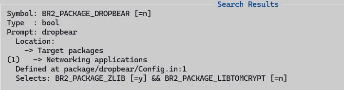
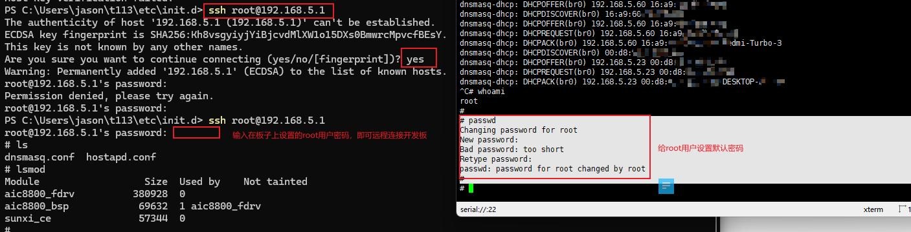
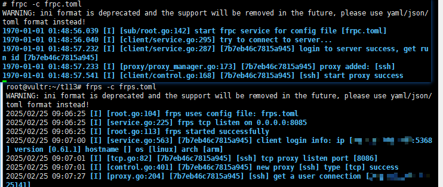

# 基于透传网络实现远程开机

## 背景

### 需求场景

这里我们想实现的目标：基于前面文章实现的4G模组透传到LAN的透传网络，实现对家里面的电脑进行远程开机功能，目前只实现基础的功能即可，可以对此扩展提高远程开机的便捷性，篇幅有限就不在本文讲解了。

#### 网络架构基础

- **内网与外网**：在网络环境中，通常存在内网（局域网，LAN）和外网（广域网，WAN）的概念。内网是指在一个相对独立的区域内，由多台设备通过交换机、路由器等网络设备连接组成的网络，如家庭网络、企业办公网络等，内部设备通常使用私有 IP 地址，如 192.168.x.x、10.x.x.x、172.16.x.x - 172.31.x.x 等网段。外网则是指全球范围内通过互联网服务提供商（ISP）相互连接的网络，设备具有全球唯一的公网 IP 地址。
- **NAT（网络地址转换）**：由于公网 IP 地址资源有限，为了让大量的内网设备能够共享有限的公网 IP 地址访问外网，NAT 技术应运而生。它允许将内网中的多个私有 IP 地址转换为一个或少数几个公网 IP 地址，实现内外网之间的数据通信。在 NAT 的作用下，外网无法直接访问内网中的设备，因为外网只知道 NAT 设备的公网 IP 地址，而不知道内网设备的私有 IP 地址。

#### 内网穿透实现方式

- **端口映射**：这是一种常见的内网穿透方法，通过在路由器或防火墙等设备上进行配置，将公网 IP 地址的某个端口映射到内网中特定设备的特定端口。这样，当外网用户访问公网 IP 的映射端口时，数据就会被转发到内网中对应的设备和端口上。
- **VPN（虚拟专用网络）**：通过在公网上建立一条加密的虚拟通道，将内网与外网连接起来。用户通过 VPN 客户端连接到 VPN 服务器，就可以像在本地局域网中一样访问内网资源，VPN 不仅可以实现内网穿透，还能保证数据传输的安全性和隐私性。
- **反向代理**：通常用于 Web 应用，在内网中部署反向代理服务器，外网用户访问反向代理服务器的公网 IP，反向代理服务器再根据配置将请求转发到内网中的 Web 服务器，实现外网对内网 Web 服务的访问。
- **使用内网穿透工具**：市面上有许多专门的内网穿透工具，如花生壳、ngrok 等。这些工具通常通过在本地安装客户端，与云端服务器建立连接，实现内网与外网之间的数据转发，用户无需进行复杂的网络配置，只需在工具中进行简单设置即可实现内网穿透。

## 远程开机实现方式

### 方案介绍

基于成本和简易型原理，测评采用frp实现内网穿透，etherwake实现远程开机。通过云主机搭建的frp反向代理服务，来代理开发板上的ssh服务，然后连接到内网开发板，再在内网开发板上执行etherwake小程序，发送Wake-on-LAN魔术包，从而唤醒内网的PC机。

### 工具和环境配置

#### rootfs开启sshd

一般嵌入式设备采用dropbear做为sshd的场景更多，搜索了一下，发现sdk里面也只有dropbear，没有openssh-server，那么直接在buildroot中开启dropbear即可。

- ```./build.sh buildroot_menuconfig```
- 搜索dropbear，选择y

- ```./build.sh buildroot_saveconfig```
- ```./build.sh pack```

#### etherwake配置

这里我们采用openwrt里面提供的开源小程序etherwake，交叉编译后放到单板根文件系统即可。

下载地址：https://ftp.debian.org/debian/pool/main/e/etherwake/etherwake_1.09.orig.tar.gz

编译方法：

```bash
jason@ubuntu18:~/t113/tina5sdk-bsp$ cd ..
jason@ubuntu18:~/t113$ ls
T113S3-PRO_TinaSDK5  tina5sdk-bsp  tina5sdk-bsp-50ae436fe556be2253856af283b1e094.tar.gz
jason@ubuntu18:~/t113$ mkdir temp
jason@ubuntu18:~/t113$ cd temp/
jason@ubuntu18:~/t113/temp$ wget https://ftp.debian.org/debian/pool/main/e/etherwake/etherwake_1.09.orig.tar.gz
jason@ubuntu18:~/t113/temp$ ls
etherwake_1.09.orig.tar.gz
jason@ubuntu18:~/t113/temp$ tar -xf etherwake_1.09.orig.tar.gz
jason@ubuntu18:~/t113/temp$ cd etherwake-1.09.orig/
jason@ubuntu18:~/t113/temp/etherwake-1.09.orig$ ls
ether-wake.c  etherwake.8
jason@ubuntu18:~/t113/temp/etherwake-1.09.orig$ ../../tina5sdk-bsp/prebuilt/rootfsbuilt/arm/gcc-arm-10.3-2021.07-x86_64-arm-none-linux-gnueabihf/bin/arm-none-linux-gnueabihf-gcc -O -Wall -o ether-wake ether-wake.c
jason@ubuntu18:~/t113/temp/etherwake-1.09.orig$ ls
ether-wake  ether-wake.c  etherwake.8
```

adb上传到开发板:

```bash
adb push ether-wake /usr/bin
```

开发板上执行示例：

```bash
# chmod +x /usr/bin/ether-wake
# ether-wake
BusyBox v1.33.2 (2025-01-04 18:53:10 CST) multi-call binary.

Usage: ether-wake [-b] [-i IFACE] [-p aa:bb:cc:dd[:ee:ff]/a.b.c.d] MAC

Send a magic packet to wake up sleeping machines.
MAC must be a station address (00:11:22:33:44:55) or
a hostname with a known 'ethers' entry.

        -b              Broadcast the packet
        -i IFACE        Interface to use (default eth0)
        -p PASSWORD     Append four or six byte PASSWORD to the packet
```

#### frp配置

frp项目是一个在github上的开源项目，会定期释放更新编译的bin文件，我们直接使用官方的release版本即可，可以在下面的链接进行下载：

https://github.com/fatedier/frp/releases/

在开发板上运行：```frpc -c frpc.toml```

在远端服务器上运行：```frps -c frps.toml```

参考配置：[通过 SSH 访问内网机器](https://gofrp.org/zh-cn/docs/examples/ssh/)

示例：

frps.toml:

> 说明：frps运行在一个有公网IP的linux主机上，并且需要防火墙开放bind_port配置指定的端口，还要开放客户端配置中remote_port配置指定的端口。

```bash
[common]
bind_port = 8085  # frp 服务器监听的端口
token = your_token  # 用于身份验证的 token，确保与客户端一致
```

> 注意：可以使用随机密码生成器生成一个32字符长度的密码，增加安全性。

frpc.toml:

```bash
[common]
server_addr = your_server_ip  # frp 服务器的 IP 地址
server_port = 8085  # frp 服务器的端口
token = your_token  # 与服务器端一致的 token

[ssh]
type = tcp  # 代理类型
local_ip = 127.0.0.1  # 本地 SSH 服务的 IP 地址
local_port = 22  # 本地 SSH 服务的端口
remote_port = 8086  # 远程访问的端口
```

### 检查本地网络环境

首先，本地PC连接到板子以太网所在的局域网内，可以直连或者通过交换机，然后ssh远程登录，测试本地是否可以，示例如下：



### 进行远程开机

首先，在公网IP服务器上运行frps，打开frp反向代理；再在单板上运行frpc，和服务器上的frps建立代理链接通道，示例如下：



然后，在外网任何一台可以连接到运行frps的服务器的PC上，运行如下指令，内网穿透连接到开发板：

```bash
ssh -p 8086 root@x.x.x.x #按提示输入密码，也可以采用公私钥的方式登录
# 下面是在开发板上运行的命令，反向代理通道已经建立，实现了外部网络直连内网开发板的ssh服务的功能
# ether-wake -i eth0 <a.b.c.d> # a.b.c.d为内网PC的MAC地址
```

> 说明：上面的frps反向代理示例只是简短功能展示，不要在自己的服务器环境上长期跑这个配置，因为没有进行额外的安全参数配置，可能会信息安全风险，切记！

在家里PC机的BIOS中开启WOL功能，然后通过上面的方式，就可以通过远程连接到开发板的SSHD服务，发送WOL魔术包到局域网，PC收到后，就会自动开机了，这个时候如果再在PC上打开向日葵等远程桌面的软件，不就可以向日葵的开机棒的功能了么。不过他们采用的更有好的交互方式，直接一个手机应用，点一下就能远程下发指令到开机棒设备上，设备再执行发送WOL魔术包，究其所以，底层实现方式都是差不多的。

## 参考链接

- [内网穿透详解](https://blog.csdn.net/m0_71832273/article/details/137377651)

- [内网穿透几种方式？怎么搭建内网穿透？](https://hsk.oray.com/news/36175.html)
- [图解正向代理和反向代理的区别_nginx配置多个正向代理](https://cloud.tencent.com/developer/article/2124577)

- [frp图解 附最新.toml配置文件](https://www.cnblogs.com/cenima/p/17849921.html)
- [【FRP应用】FRPS服务部署实现](https://blog.csdn.net/m0_59806124/article/details/143234414)
