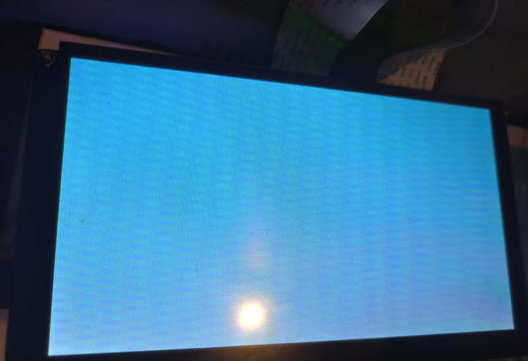

# LinuxFB介绍

## 什么是 Linux Framebuffer？

Linux Framebuffer（简称 LinuxFB）是一个为 Linux 系统提供的显示框架，用于处理图形显示。它为操作系统提供了一个抽象层，使得应用程序能够在不同的硬件上以一致的方式进行图像渲染。Framebuffer 是一个内存区域，通常是物理显示器的图像缓冲区，通过该缓冲区显示图像内容。Framebuffer 直接与显示设备交互，能够提供高效的图像渲染功能，尤其适用于嵌入式系统、裸机应用等没有图形桌面环境的环境。

## 工作原理

Framebuffer 作为一个内存区域，通常由图形硬件映射到物理显示屏上的像素阵列中。图形显示时，操作系统和应用程序可以通过对 framebuffer 内存的操作来控制显示内容。Framebuffer 通常与图形硬件紧密结合，操作系统通过指定显示设备的参数（如分辨率、颜色深度等）来配置 framebuffer。

在 Linux 系统中，Framebuffer 设备通常以 `/dev/fb0`（或其他 `/dev/fbX`）的形式存在。Linux 内核通过驱动程序来提供 framebuffer 设备支持。用户空间的应用程序通过特定的接口（如 ioctl()）来操作 framebuffer，从而达到显示图像、更新内容等目的。

## 功能和特性

- **独立于硬件平台**：Framebuffer 为用户提供了一种硬件无关的显示接口，使得应用程序能够以相同的方式处理显示，而不必关心底层硬件的具体实现。无论是基于 x86 架构的个人计算机，还是嵌入式 ARM 系统，Framebuffer 都能提供一致的 API 接口。
- **支持多种颜色格式**：Framebuffer 支持多种颜色深度和颜色格式，常见的颜色深度包括 8-bit、16-bit、24-bit 和 32-bit。用户可以根据实际需求选择合适的颜色深度。例如，在嵌入式系统中，通常使用 16-bit 色深（RGB565 格式）来平衡显示效果和内存消耗。
- **支持像素操作**：通过直接对 framebuffer 内存的操作，用户可以快速进行像素级别的操作。这使得一些低级的图形渲染操作（如自定义图标绘制、屏幕刷新）可以更加高效。
- **兼容性**：Framebuffer 驱动是 Linux 内核的一部分，支持多种不同的硬件平台，包括主流的集成显卡（如 Intel、AMD、NVIDIA）以及嵌入式图形芯片（如 ARM、Mali、Vivante 等）。
- **不依赖桌面环境**：Framebuffer 是一个轻量级的显示技术，它不需要图形桌面环境（如 X Window 或 Wayland）。这种特性使其非常适合嵌入式系统、最小化操作系统或者用于裸机开发的应用程序。

## 核心组成部分

- **Framebuffer 设备（/dev/fbX）**：每个显示设备都由一个 framebuffer 设备节点来表示。在 Linux 中，Framebuffer 设备节点通常位于 `/dev` 目录下，例如 `/dev/fb0`。应用程序可以通过打开该设备节点并对其进行读取、写入操作来控制显示内容。
- **Framebuffer 驱动程序**：每个图形硬件通常需要一个相应的 framebuffer 驱动程序，以便 Linux 内核能够识别并支持该硬件。
- **Framebuffer 字符设备接口**：Framebuffer 提供了一个字符设备接口，应用程序通过读取和写入该设备节点，向 framebuffer 内存中写入图像数据。
- **Framebuffer 内存**：Framebuffer 是一块连续的内存区域，通常映射到显示硬件的显存区域。
- **图像渲染**：渲染图像通常包括像素填充、颜色调整、透明度处理等，应用程序通过设置像素值、绘制图形等方式来更新 framebuffer 中的内容。

## 工作流程

1. **初始化**：当系统启动时，内核会识别并初始化与显示相关的硬件设备，加载相应的 framebuffer 驱动程序，并创建 framebuffer 设备节点。
2. **打开设备**：应用程序通过打开 `/dev/fb0` 或其他 framebuffer 设备节点来与 framebuffer 进行交互。
3. **写入图像数据**：应用程序可以通过写入 framebuffer 设备来更新显示内容，直接操作 framebuffer 内存，更新显示区域的像素数据。
4. **刷新显示**：显示硬件自动或手动将 framebuffer 的数据更新到物理显示器上。
5. **关闭设备**：应用结束时，关闭 framebuffer 设备，释放资源。

## 应用场景

- **嵌入式系统**：Framebuffer 适合在嵌入式系统中使用，嵌入式设备通常具有特定的显示需求（如小屏幕、低功耗显示），使用 framebuffer 可以节省系统资源并提高性能。
- **裸机图形应用**：在一些没有操作系统支持的应用中，Framebuffer 提供了一个直接与显示硬件交互的接口。
- **最小化操作系统**：对于一些最小化的 Linux 发行版，Framebuffer 提供了一个简单有效的图形接口。
- **虚拟化环境**：Framebuffer 也可以在虚拟机中使用，通过虚拟 framebuffer，虚拟机能够以较低的开销提供图形显示。

## T113s3使用案例

c代码：

```c
#include <stdio.h>
#include <sys/types.h>                //open需要的头文件
#include <sys/stat.h>
#include <fcntl.h>
#include <unistd.h>                //write
#include <sys/types.h>
#include <sys/mman.h>                //mmap  内存映射相关函数库
#include <stdlib.h>                //malloc free 动态内存申请和释放函数头文件
#include <string.h>         
#include <linux/fb.h>
#include <sys/ioctl.h>

//32位的颜色
#define Black         0x00000000
#define White         0xffFFFFFF
#define Red         0xffFF0000
#define Green         0xff00ff00
#define Blue         0xff99ffff

int fd;
unsigned int *fb_mem  = NULL;        //设置显存的位数为32位
struct fb_var_screeninfo var;
struct fb_fix_screeninfo fix;

int main(void)
{
        unsigned int i;
        int ret;

        /*--------------第一步--------------*/
        fd = open("/dev/fb0",O_RDWR);                        //打开framebuffer设备
        if(fd == -1){
                perror("Open LCD");
                return -1;
        }

        /*--------------第二步--------------*/
        //获取屏幕的可变参数
        ioctl(fd, FBIOGET_VSCREENINFO, &var);
        //获取屏幕的固定参数
        ioctl(fd, FBIOGET_FSCREENINFO, &fix);
       
          //打印分辨率
        printf("xres= %d,yres= %d \n",var.xres,var.yres);
         //打印总字节数和每行的长度
        printf("line_length=%d,smem_len= %d \n",fix.line_length,fix.smem_len);
        printf("xpanstep=%d,ypanstep= %d \n",fix.xpanstep,fix.ypanstep);

        /*--------------第三步--------------*/
        
  fb_mem = (unsigned int *)mmap(NULL, var.xres*var.yres*4,                 //获取显存，映射内存
                        PROT_READ |  PROT_WRITE, MAP_SHARED, fd, 0);  
  
        if(fb_mem == MAP_FAILED){
                perror("Mmap LCD");
                return -1;        
        }

        memset(fb_mem,0xff,var.xres*var.yres*4);                //清屏
        sleep(1);

        /*--------------第四步--------------*/
        //将屏幕全部设置成蓝色
        for(i=0;i< var.xres*var.yres ;i++)
                fb_mem[i] = Blue;
        sleep(2);
        memset(fb_mem,0x00,var.xres*var.yres*4);                //清屏
        
        munmap(fb_mem,var.xres*var.yres*4); //映射后的地址，通过mmap返回的值        
        close(fd);                         //关闭fb0设备文件
        return 0;                        
}
```

代码运行效果屏幕变成蓝色：


