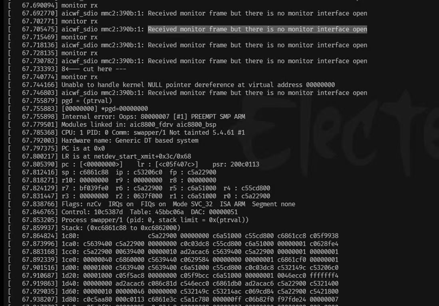
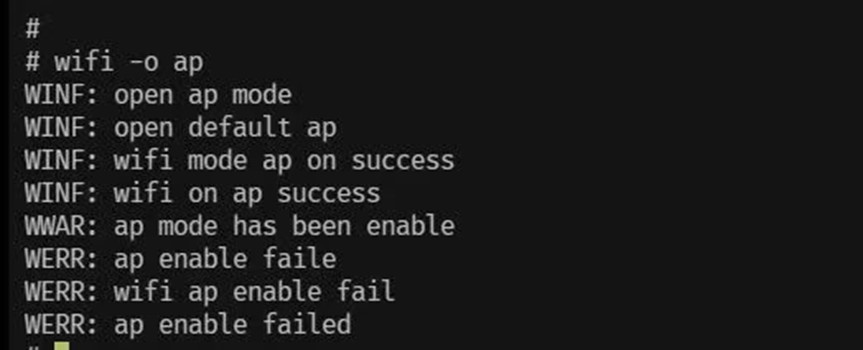
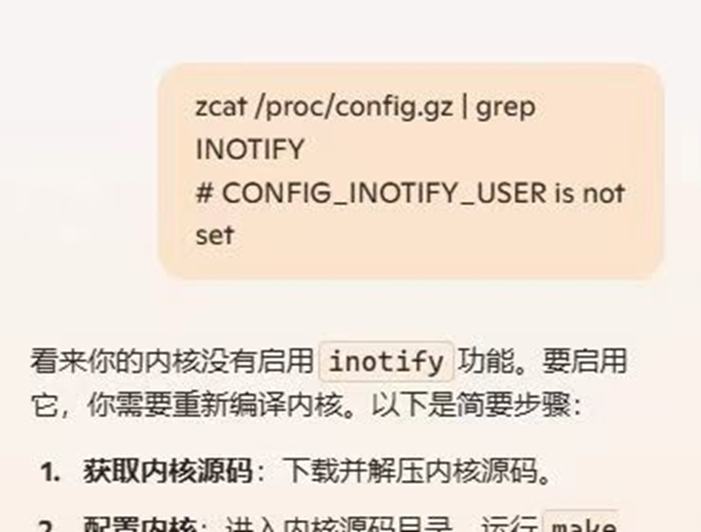
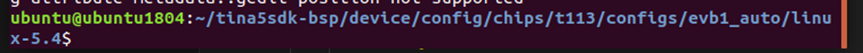
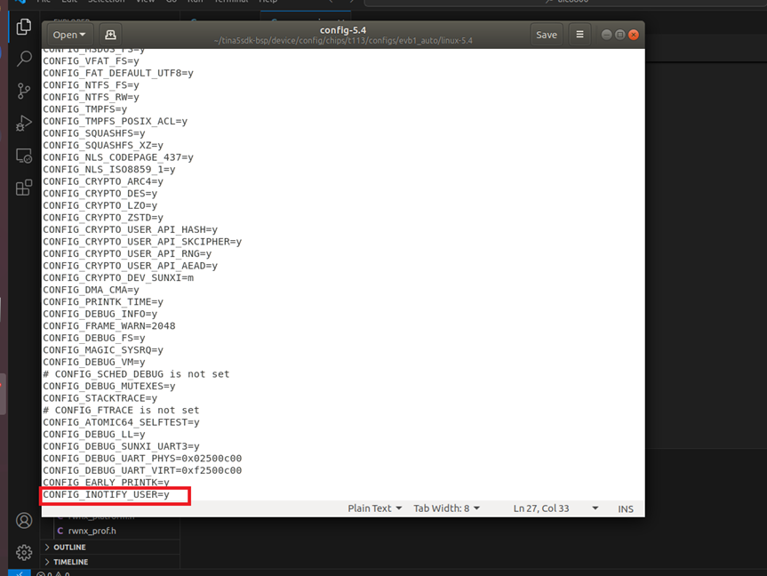

# aic8800网卡开启AP模式

## 尝试开启网卡监视模式

**网卡监视模式介绍:**

**网卡监视模式（Monitor Mode）**，有时也被称为“**混杂模式（Promiscuous Mode）**”，是一种网络适配器的工作方式，允许网卡被动地接收和捕获其网络接口上的所有数据包，而不仅仅是发往其自身的数据包。这一功能对于网络分析、安全监测和故障排查等任务至关重要。以下是对网卡监视模式的详细介绍：

### 网卡监视模式的工作原理
在标准工作模式下，网卡通常只会接收发往其MAC地址的数据包。然而，在**监视模式下**，网卡会忽略数据包的目的地址字段，从而接收网络上的所有数据包，包括广播包、多播包和其他主机间的单播包。无线网卡可以在不同的频道之间切换，以捕获特定频率范围内的流量。

### 应用场景
网卡监视模式在多种场景下有着广泛应用，包括：

* **网络故障排查**：通过监视整个网络上的数据流量，网络管理员可以快速识别并诊断网络故障。例如，管理员可以检测到是否存在网络瓶颈、丢包现象或不正常的流量模式。
* **网络安全监测**：网卡监视模式在入侵检测系统（IDS）和入侵防御系统（IPS）中起着关键作用。它使得安全专家能够捕获和分析潜在的攻击流量，从而及时采取措施应对网络攻击。此外，监视模式还可用于检测网络中的恶意活动，如ARP欺骗、DNS欺骗和网络嗅探。
* **流量分析**：通过监视模式捕获的网络流量数据，网络分析工具可以对网络性能进行评估。这有助于理解网络利用率、识别流量模式以及优化网络配置。例如，管理员可以分析带宽使用情况、识别高流量用户或应用程序，并据此进行相应的调整。

### 技术实现
实现网卡监视模式通常需要特定的软件和驱动程序支持。在 **Windows操作系统** 中，常见的网络分析工具如 **Wireshark**、**Microsoft Network Monitor** 可以配置网卡进入监视模式。在**Linux系统**中，可以使用 **iwconfig 命令** 或 **airmon-ng 工具 **将无线网卡切换到监视模式。此外，某些硬件网卡可能也需要支持监视模式功能。

### 无线网络监视
**无线网络监视模式** 是一种特殊的应用场景，它允许无线网卡捕获特定频段内的所有Wi-Fi数据包。这在无线网络安全测试和性能分析中尤为重要。例如，安全研究人员可以通过监视模式捕获Wi-Fi密码破解攻击的流量，从而对网络安全性进行评估。

### 法律和道德考虑
使用网卡监视模式捕获网络流量需要考虑法律和道德问题。在某些地区，未经授权的网络流量捕获和分析可能违反相关法规。因此，在进行网络监视时，务必要确保获得适当的授权和许可。此外，保护捕获数据中的隐私信息也至关重要，应采取加密和数据脱敏等措施。

## 问题

由于aic8800网卡驱动原因无法调整至监视模式。开启监视模式后系统崩溃:

## 尝试开启网卡AP模式

### 网卡AP模式介绍

**网卡AP模式（Access Point模式）** 即无线接入点模式，是指无线网卡作为无线接入点（AP），提供无线网络接入服务。主要用于在没有路由器的情况下，将有线网络转换为无线网络，方便多个无线设备连接使用。

在AP模式下，网卡通过无线信号与其他无线设备（如手机、笔记本电脑、平板电脑等）建立连接，并将这些设备接入到局域网中，从而实现无线网络的共享。其工作原理类似于无线路由器，但并不具备路由器的完整功能，如NAT（网络地址转换）等。

### AP模式的应用场景
AP模式的应用场景主要包括以下几种：

* **临时无线网络**：在一些会议、展会等场合，AP模式可以快速搭建临时无线网络，供与会者使用。
* **无线扩展**：在家庭或办公场所，使用AP模式可以扩展现有无线网络的覆盖范围，解决信号盲区问题。
* **网络共享**：在没有路由器的环境下，使用AP模式可以将有线网络共享给多个无线设备，解决网络连接难题。

### 网卡AP模式的设置步骤如下：

* **确认网卡支持AP模式**：首先需要确认所使用的无线网卡支持AP模式，可以查阅网卡说明书或厂商网站获取相关信息。
* **安装驱动程序**：确保无线网卡的驱动程序已经正确安装，并且支持AP模式。
* **配置AP模式**：通过网卡驱动程序或管理软件，选择AP模式，并进行相关配置，如设置SSID（网络名称）、加密方式（如WPA2）、密码等。
* **连接设备**：配置完成后，其他无线设备即可搜索到该AP，并进行连接。

## T113s3默认镜像开始AP模式失败

开始AP模式失败:

内核没有开启CONFIG_INOTIFY:

找到内核配置文件位置:

在内核配置文章末尾添加 CONFIG_INOTIFY_USER=y:

再次开启AP模式成功。

