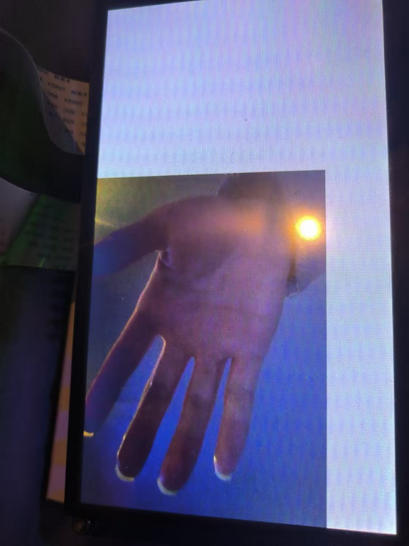

# 无线传屏显示

在 T113s3 上使用无线网卡接收视频并且显示到屏幕上面。

## MJPEG编码介绍

MJPEG（Motion JPEG）是一种视频编码格式，它将每一帧图像（静态图像）作为JPEG（Joint Photographic Experts Group）格式的单独图像进行压缩和编码。简单来说，MJPEG是一种将视频中的每一帧当作独立的JPEG图像来编码的视频编码格式，而不是像H.264、HEVC等那样使用基于帧间预测的压缩方式。

## MJPEG编码格式的特点

- **每帧图像独立编码**：
  - 在MJPEG中，每一帧图像都被压缩为单独的JPEG图像。
  - 这意味着视频中的每一帧都是独立的JPEG图像，而不像其他视频编码格式那样依赖帧间差异（如I帧、P帧和B帧）。

- **压缩效率较低**：
  - 由于每一帧都是独立编码的，MJPEG相比于更复杂的编码格式（如H.264、H.265）具有较低的压缩效率。特别是在高帧率的视频中，MJPEG的压缩效率往往不如其他编码格式。
  - 因为它不利用帧间差异，所以对比例如H.264的视频，MJPEG文件的大小通常会更大。

- **高解码效率**：
  - MJPEG的一个优势是解码效率非常高，因为每一帧都是独立的JPEG图像。解码时不需要参考其他帧，只需要解码每一帧JPEG图像即可。这使得MJPEG在硬件解码上非常高效，适合嵌入式系统、实时视频传输等场景。

- **适用于实时视频流**：
  - MJPEG通常用于需要实时、低延迟的视频流应用。例如，很多网络摄像头、监控摄像头、视频会议系统等使用MJPEG进行视频传输。

- 简单的编码和解码流程：
  - 由于MJPEG是基于JPEG图像压缩的，因此它的编码和解码算法相对简单。在很多嵌入式系统中，由于其简单性，MJPEG常常被用于实时视频捕获和显示。

## MJPEG的工作原理

- 编码：
  - 视频的每一帧图像都通过JPEG压缩标准单独进行压缩。JPEG图像压缩通常采用离散余弦变换（DCT）对图像进行压缩，通过丢弃一些不显著的信息来减小图像文件的大小。
  - 每一帧图像的JPEG压缩过程与普通的静态JPEG图像压缩类似。具体步骤包括颜色空间转换（通常是从RGB转为YUV格式），离散余弦变换（DCT），量化，霍夫曼编码等。

- 

- 解码：
  - 解码过程很简单，MJPEG视频流的每一帧视频只需要将JPEG图像逐一解码出来，不需要参考其他帧。因此，解码器可以直接将每一帧的JPEG图像解码为RGB或者YUV图像格式来显示。

## MJPEG的应用场景

- **网络摄像头和监控系统**：
很多低成本的网络摄像头使用MJPEG格式进行视频流传输，因为MJPEG可以简化硬件解码过程，并且对于实时视频监控应用来说，延迟要求较高，而MJPEG解码较为快速。

- **视频会议**：
MJPEG也广泛应用于视频会议系统，特别是在低带宽网络环境下，它的简单性有时比高压缩率的编码方式（如H.264）更能提供稳定的实时视频流。

- **嵌入式系统和实时视频捕捉**：
在嵌入式系统中，MJPEG由于其简单性和解码的高效性，成为实时视频捕捉和流媒体传输的理想选择，尤其在资源有限的设备中。

- **低带宽视频流**：
MJPEG适用于带宽受限的应用，比如低带宽的网络传输环境下，尤其是无法支持更复杂编码格式（如H.264或H.265）的情况下。

## MJPEG的优缺点

**优点：**

- **解码简单**：每帧是独立的JPEG图像，不需要参考其他帧，解码非常快速和简单。
- **低延迟**：由于每一帧都是独立的，可以快速解码和显示，适合实时视频流。
- **硬件解码支持广泛**：许多嵌入式平台和设备提供硬件JPEG解码支持，能够高效地处理MJPEG视频流。
- **无需复杂的编码/解码设置**：相较于如H.264等复杂的编解码算法，MJPEG的编码/解码过程更为简单。

**缺点：**

- **压缩效率较低**：每一帧都独立编码，不利用帧间差异，导致相较于其他视频编码格式（如H.264）有更大的文件尺寸。
- **文件大小较大**：尤其是在高分辨率和高帧率的情况下，MJPEG生成的视频文件比H.264等编码格式更大。
- **不适合长时间视频存储**：由于每帧都需要存储完整的图像数据，MJPEG不适合用于需要高存储效率的视频存储场景。

**总结：**

MJPEG格式通过将每一帧视频单独压缩为JPEG图像来处理视频流，虽然这种方式导致了压缩效率低，但它的解码速度快、延迟低、硬件支持广泛，适合实时视频传输和低带宽应用。MJPEG特别适合嵌入式设备、监控系统、视频会议等场景，但对于长时间存储和高压缩效率的需求，其他视频编码格式（如H.264、H.265）会更具优势。

## 整体思路

1. 将UVC 相机插入装有linux系统的个人电脑；

2. 从UVC 相机获取MJPEG数据并发送；
3. 通过 T113s3板载的aic8800网卡接收并显示在屏幕上面。

**具体代码如下：**

T113s3接收端：

```c
#include <unistd.h>
#include <stdlib.h>
#include <stdio.h>
#include <string.h>
#include <ctype.h>
#include <errno.h>
#include <jpegdecode.h>

#include <fcntl.h>       // For open and O_RDWR
#include <linux/fb.h>    // For fb_var_screeninfo
#include <sys/ioctl.h>   // For ioctl
#include <sys/mman.h>    // For mmap, PROT_READ, PROT_WRITE, MAP_SHARED, MAP_FAILED
#include <signal.h>  // 需要添加这个头文件

#include <sys/socket.h>
#include <netinet/in.h>
#include <arpa/inet.h>

#define image_width 640
#define image_height 480

#define UDP_PORT 12345
#define UDP_BUFFER_SIZE 65507
pthread_t udp_thread;  // 用于接收 UDP 消息的线程
volatile int  stop_server = 0;  // 用于标记是否停止服务器的标志
int sockfd;

unsigned char *frame_data = NULL;
int frame_data_size = 0;

int framebufferfd;
unsigned int *fb_mem  = NULL;        //设置显存的位数为32位
struct fb_var_screeninfo var;
struct fb_fix_screeninfo fix;

//信号处理函数，用于捕获 Ctrl+C (SIGINT) 信号
void sigint_handler(int sig){
    stop_server = 1;  // 设置标志，通知 UDP 服务器线程退出
    shutdown(sockfd, SHUT_RDWR);  // 关闭读写通道
    close(sockfd);
    printf("\nStopping UDP server...\n");
}

void writeDataToFile(const char *filename, uint8_t *data, size_t dataSize)
{
    if (data == NULL)
    {
        printf("Error: data is NULL\n");
        return;
    }

    FILE *f = fopen(filename, "wb");
    if (f == NULL)
    {
        printf("Error opening file for writing\n");
        return;
    }

    size_t written = fwrite(data, 1, dataSize, f);
    if (written != dataSize)
    {
        printf("Error writing data to file, written = %zu, expected = %zu\n", written, dataSize);
    }

    if (fclose(f) != 0)
    {
        printf("Error closing file\n");
    }
    else
    {
        printf("Data written to %s\n", filename);
    }
}

void convertRGB565ToRGBA8888( const char *filename, const uint8_t *rgb565Data, uint8_t *rgb888Data, uint8_t*rgba8888Data, int width, int height) {
    // 原始图像宽高
    int src_width = 640;
    int src_height = 480;

    // 屏幕宽高
    int dst_width = 1024;
    int dst_height = 600;

    

    if (rgb565Data == NULL) {
        printf("Error: RGB565 data is NULL\n");
        return;
    }

    int pixelCount = width * height;
    size_t rgb565Size = pixelCount * 2;  // RGB565每个像素占2字节
    if (rgb565Size <= 0) {
        printf("Error: Invalid width or height\n");
        return;
    }

    if (rgb888Data == NULL) {
        printf("Error: Failed to allocate memory for RGB888 data\n");
        return;
    }

    for (int y = 0; y < src_height; y++) {
        for (int x = 0; x < src_width; x++) {
            // 组合两个字节为16位像素值（假设小端存储：低字节在前，高字节在后）
            uint16_t pixel = ((uint16_t)rgb565Data[2*(y * src_width + x) + 1] << 8) | rgb565Data[2*(y * src_width + x)];

            // 提取RGB分量
            uint8_t r = (pixel >> 11) & 0x1F;  // 高5位
            uint8_t g = (pixel >> 5)  & 0x3F;  // 中间6位
            uint8_t b = pixel         & 0x1F;  // 低5位

            // 将5-6位扩展到8位（使用左移和按位或操作）
            rgb888Data[(y * src_width + x)*3]     = (r << 3) | (r >> 2);  // R
            rgb888Data[(y * src_width + x)*3 + 1] = (g << 2) | (g >> 4);  // G
            rgb888Data[(y * src_width + x)*3 + 2] = (b << 3) | (b >> 2);  // B
            
            rgba8888Data[(y * src_width + x) * 4 + 0] = rgb888Data[(y * src_width + x)*3 + 2];  // BGRA格式
            rgba8888Data[(y * src_width + x)* 4 + 1] = rgb888Data[(y * src_width + x)*3 + 1];
            rgba8888Data[(y * src_width + x) * 4 + 2] =  rgb888Data[(y * src_width + x)*3] ;
            rgba8888Data[(y * src_width + x) * 4 + 3] = 255; // Alpha通道设为不透明
            
            uint8_t ra = rgba8888Data[(y * src_width + x) * 4 + 0];
            uint8_t ga = rgba8888Data[(y * src_width + x) * 4 + 1];
            uint8_t ba = rgba8888Data[(y * src_width + x) * 4 + 2];
            uint8_t aa= rgba8888Data[(y * src_width + x) * 4 + 3];
            // 计算 framebuffer 中对应的位置，直接从左上角开始填充
            int fb_index = (y * dst_width + x);  // framebuffer 的索引
             // 将 RGBA 数据转换为 BGRA 格式
            fb_mem[fb_index] = (aa << 24) | (ba << 16) | (ga << 8) | ra;
        }

    }

    return ;


    //writeDataToFile(filename,rgb888Data,width*height*3);
}

static char *readSrcData(char *path, int *pLen)
{
    FILE *fp = NULL;
    int ret = 0;
    char *data = NULL;

    // 打开文件，以二进制模式读取
    fp = fopen(path, "rb");
    if(fp == NULL)
    {
        printf("read jpeg file error, errno(%d)\n", errno);
        return NULL;
    }

    // 将文件指针移动到文件末尾
    fseek(fp, 0, SEEK_END);
    // 获取文件的字节数并赋值给pLen
    *pLen = ftell(fp);
    // 将文件指针重新移动到文件开头
    rewind(fp);

    // 分配一个大小为pLen的内存块
    data = (char *) malloc(sizeof(char) * (*pLen));
    if(data == NULL)
    {   // 如果内存分配失败，打印错误信息并关闭文件，返回NULL
        printf("malloc memory fail\n");
        fclose(fp);
        return NULL;
    }

    // 从文件中读取数据到data缓冲区
    ret = fread(data, 1, *pLen, fp);
    if (ret != *pLen)
    {
         // 如果读取的数据字节数与期望的不一致，打印错误信息，释放内存并关闭文件，返回NULL
        printf("read src file fail\n");
        fclose(fp);
        free(data);
        return NULL;
    }

    // 关闭文件
    fclose(fp);
    return data;
}

int jpegdecodePacktest(char *srcBuf, int srcBufLen, JpegDecodeScaleDownRatio scaleRatio, JpegDecodeOutputDataType outputDataTpe , uint8_t *rgb888Data, uint8_t *rgba8888Data)
{
    
    JpegDecoder* jpegdecoder;
    jpegdecoder = JpegDecoderCreate();

    if(NULL == jpegdecoder)
    {
        printf("create jpegdecoder failed\n");
        return -1;
    }

    JpegDecoderSetDataSourceBuf(jpegdecoder, srcBuf, srcBufLen, scaleRatio, outputDataTpe);
    printf("srcBuf = %p, srcBufLen = %d\n", srcBuf, srcBufLen);

    // JpegDecoderSetDataSource(jpegdecoder, argv[1], scaleRatio, outputDataTpe);
    printf("JpegDecoderSetDataSource end\n");

    ImgFrame* imgFrame  = JpegDecoderGetFrame(jpegdecoder);

    if(imgFrame == NULL){
        printf("JpegDecoderGetFrame fail\n");
        JpegDecoderDestory(jpegdecoder);
        return -1;
    } else {
        printf("JpegDecoderGetFrame successfully, imgFrame->mWidth = %d, imgFrame->mHeight = %d, imgFrame->mYuvData = %p, imgFrame->mYuvSize = %d\n",
            imgFrame->mWidth, imgFrame->mHeight, imgFrame->mYuvData, imgFrame->mYuvSize);
        printf("imgFrame->mRGB565Data = %p, imgFrame->mRGB565Size = %d\n", imgFrame->mRGB565Data, imgFrame->mRGB565Size);

        // // 将解码后的 RGB565 数据写入文件
         //writeDataToFile("output.rgb565", imgFrame->mRGB565Data, imgFrame->mRGB565Size);

         convertRGB565ToRGBA8888("output.rgb888", imgFrame->mRGB565Data, rgb888Data, rgba8888Data, image_width,image_height);
        
    }

    JpegDecoderDestory(jpegdecoder);

   

    return 0;

}


int linuxfbinit( )
{
   
    unsigned int i;
    int ret;
   

    /*--------------第一步--------------*/
    framebufferfd = open("/dev/fb0",O_RDWR);                        //打开framebuffer设备
    if(framebufferfd == -1){
        perror("Open LCD");
        return -1;
    }
    /*--------------第二步--------------*/

     //获取屏幕的可变参数
    ioctl(framebufferfd, FBIOGET_VSCREENINFO, &var);
    //获取屏幕的固定参数
    ioctl(framebufferfd, FBIOGET_FSCREENINFO, &fix);

      //打印分辨率
    printf("xres= %d,yres= %d \n",var.xres,var.yres);
     //打印总字节数和每行的长度
    printf("line_length=%d,smem_len= %d \n",fix.line_length,fix.smem_len);
    printf("xpanstep=%d,ypanstep= %d \n",fix.xpanstep,fix.ypanstep);

    /*--------------第三步--------------*/

    fb_mem = (unsigned int *)mmap(NULL, var.xres*var.yres*4,                 //获取显存，映射内存
        PROT_READ |  PROT_WRITE, MAP_SHARED, framebufferfd, 0);   
                              
    if(fb_mem == MAP_FAILED){
        perror("Mmap LCD");
        return -1;        
    }

    memset(fb_mem,0xff,var.xres*var.yres*4);                //清屏
    return 0;
}


// 主函数
int main(int argc, char** argv)
{
    //设置信号处理函数
    signal(SIGINT, sigint_handler);  // 捕获 Ctrl+C 发送的 SIGINT 信号

    struct sockaddr_in  server_addr, client_addr;
    socklen_t  addr_len  = sizeof(client_addr);
    char socbuffer[UDP_BUFFER_SIZE];
    frame_data_size = 0;
 
    // 创建 UDP 套接字
    if( (sockfd = socket(AF_INET, SOCK_DGRAM, 0)) < 0 )
    {
         perror("UDP socket creation failed");
         return -1;
    }
 
    // 配置服务器地址
    memset(&server_addr, 0, sizeof(server_addr));
    server_addr.sin_family = AF_INET;
    server_addr.sin_addr.s_addr = inet_addr("192.168.5.1");  // 绑定到 192.168.5.1 地址
    server_addr.sin_port = htons(UDP_PORT);  // 绑定端口 12345
 
    // 绑定套接字到指定地址和端口
    if (bind(sockfd, (struct sockaddr *)&server_addr, sizeof(server_addr)) < 0) {
        perror("UDP bind failed");
        close(sockfd);
        return -1;
    }
    printf("UDP server listening on 192.168.5.1:%d...\n", UDP_PORT);
 


    printf("****************************************************************************\n");
    printf("* This program shows how to decode a jpeg picture to yuv or rgb data\n");
    printf("***************************************************************************\n");

    if(argc != 4)
    {
        printf("Usage:\n");
        printf("jpegdecodedemo argv[1] argv[2] argv[3] \n");
        printf(" argv[1]: the jpeg file which contains absolute path\n");
        printf(" argv[2]: the scaledown mode,support :0,1,2,3;0 means no scaledown,1 means scaledown 1/2,2 means scaledown 1/4,3 means scaledown 1/8 \n");
        printf(" argv[3]: the decoded data type,support:nv21 nv12 yu12 yv12 and rgb565 \n");
        printf("for example:jpegdecodedemo /mnt/SDCARD/test.jpg 1 yv12 \n");
        return -1;
    }

    uint8_t *rgb888Data = (uint8_t *)malloc(image_width * image_height * 3); // 3字节每像素 RGB888
    uint8_t *rgba8888Data = (uint8_t *)malloc(image_width * image_height * 4); 

    JpegDecodeScaleDownRatio scaleRatio;
    int inputScaledown = atoi(argv[2]);
    switch(inputScaledown)
    {
        case 0:
            scaleRatio = JPEG_DECODE_SCALE_DOWN_1;
            break;
        case 1:
            scaleRatio = JPEG_DECODE_SCALE_DOWN_2;
            break;
        case 2:
            scaleRatio = JPEG_DECODE_SCALE_DOWN_4;
            break;
        case 3:
            scaleRatio = JPEG_DECODE_SCALE_DOWN_8;
            break;
        default:
            printf("the input scaledown ratio:%d is not support,use the default 0\n", inputScaledown);
            scaleRatio = JPEG_DECODE_SCALE_DOWN_1;
            break;
    }

    JpegDecodeOutputDataType outputDataTpe;
    if(strcmp(argv[3], "nv21") == 0){
        outputDataTpe = JpegDecodeOutputDataNV21;
    } else if(strcmp(argv[3], "nv12") == 0){
        outputDataTpe = JpegDecodeOutputDataNV12;
    } else if(strcmp(argv[3], "yu12") == 0){
        outputDataTpe = JpegDecodeOutputDataYU12;
    } else if(strcmp(argv[3], "yv12") == 0){
        outputDataTpe = JpegDecodeOutputDataYV12;
    } else if(strcmp(argv[3], "rgb565") == 0){
        outputDataTpe = JpegDecodeOutputDataRGB565;
    } else {
        printf("the %s is not support,use the default outputDataTpe:nv21\n", argv[3]);
        outputDataTpe = JpegDecodeOutputDataNV21;
    }
    
    linuxfbinit( );
    
    while (stop_server == 0)
    {
        int len = recvfrom(sockfd, (char *)socbuffer, UDP_BUFFER_SIZE, MSG_WAITALL,
                            (struct sockaddr *)&client_addr, &addr_len);
    
        if (len < 0)
        {
            perror("UDP recvfrom failed");
        }
        else
        {
            printf("Received message of length: %d bytes\n", len);
    
            // 确保数据长度符合要求
            if (len <= 0 || len > UDP_BUFFER_SIZE)
            {
                printf("Invalid data length\n");
                continue;
            }
    
            // 清空并重新分配帧缓冲区
            free(frame_data);
            frame_data = (char *)malloc(len);
            if (frame_data == NULL)
            {
                perror("Memory allocation failed");
                frame_data_size = 0;
                continue;
            }
    
            // 将接收到的数据复制到帧缓冲区
            memcpy(frame_data, socbuffer, len);
            frame_data_size = len;
    
            printf("New frame received, processing...\n");
            /*
            char* srcBuf;
            int srcBufLen = 0;
            srcBuf = readSrcData(argv[1], &srcBufLen);
            */

            // 调用解码函数，确保解码后的内存管理正确
            jpegdecodePacktest(frame_data, frame_data_size, scaleRatio, outputDataTpe, rgb888Data, rgba8888Data);
           
            // 确保解码后不重复释放内存
            // 如果解码过程中已分配了内存并释放，请确保在此不再调用 free(frame_data)
            frame_data_size = 0;
            frame_data = NULL;
        }
    }
    
    munmap(fb_mem,var.xres*var.yres*4); //映射后的地址，通过mmap返回的值        
    
    close(framebufferfd);                         //关闭fb0设备文件
    close(sockfd);

    printf("UDP server thread stopped.\n");
    printf("\n");
    printf("*************************************************************************\n");
    printf("* Quit the program, goodbye!\n");
    printf("********************************************************************\n");
    printf("\n");

    return 0;
}
```

接收截图如下：

