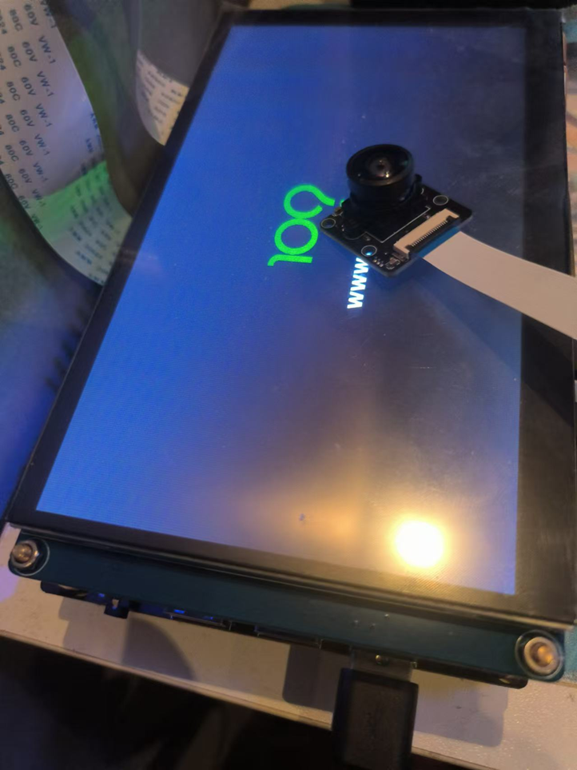
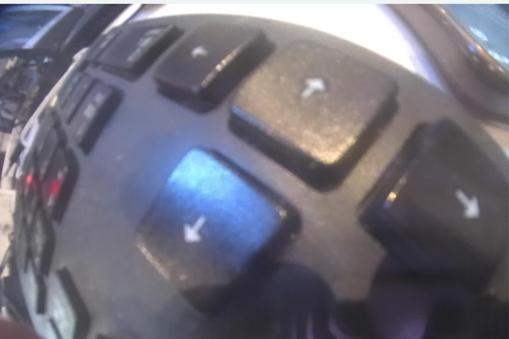

# 基于V4L2框架发送UVC视频

## UVC 背景概念

UVC（USB Video Class）相机是一种基于 USB 接口的视频设备，广泛应用于各种视频采集和处理场景。UVC 协议由 USB Implementers Forum（USB-IF）定义，旨在为 USB 摄像头、数字视频相机等设备提供统一的驱动和接口规范。以下是对 UVC 相机的详细介绍。

### UVC 协议的基本概念

UVC 协议是 USB 设备类协议的一部分，专门用于视频设备。它定义了视频设备与主机之间的数据传输和控制接口，使得不同厂商生产的摄像头可以通过统一的驱动程序在操作系统中使用。UVC 协议的主要特点是即插即用，用户无需安装特定的驱动程序，只需将摄像头连接到兼容的系统（如 Windows、Linux、macOS 等），即可使用。

### UVC 相机的工作原理

UVC 相机通过 USB 接口与主机连接，主机通过 UVC 协议与相机进行通信。相机将采集到的视频数据通过 USB 接口传输到主机，主机再将视频数据进行处理和显示。UVC 协议支持多种视频格式和分辨率，用户可以根据需要进行配置。

### UVC 相机的主要功能

- **视频采集**：UVC 相机可以通过摄像头采集视频数据，并将其传输到主机。用户可以设置视频的分辨率、帧率、亮度、对比度等参数。
- **视频输出**：UVC 相机支持将视频数据输出到显示设备，如显示器或电视，支持多种分辨率和颜色格式。
- **视频覆盖**：UVC 相机提供视频覆盖功能，可以在视频图像上叠加文本或图形信息，实现丰富的显示效果。
- **视频编解码**：UVC 相机支持多种视频编解码格式，包括 MPEG、H.264 等，能够对视频数据进行压缩和解压缩。

### UVC 相机的应用场景

UVC 相机在许多领域有广泛应用，包括但不限于：

- **视频监控**：通过摄像头采集实时视频数据并传输到监控服务器进行处理和存储。
- **视频会议**：通过摄像头和麦克风采集会议音视频数据并传输到远程终端，实现实时通信。
- **多媒体娱乐**：如数字电视、直播和录播系统等。
- **医疗影像**：在医疗领域，UVC 相机可以用于内窥镜、显微镜等设备，采集和传输高质量的医疗影像数据。

### UVC 相机的优势

- **即插即用**：UVC 相机无需安装特定的驱动程序，只需将摄像头连接到兼容的系统，即可使用。
- **标准化接口**：UVC 协议提供了统一的 API，使得用户空间程序可以方便地与不同类型的视频设备进行交互。
- **高性能**：UVC 相机采用 USB 接口，数据传输速度快，视频质量高。
- **灵活性**：UVC 相机支持多种视频格式和分辨率，适用于不同的应用场景。
- **扩展性**：UVC 协议支持通过插件和扩展模块添加新的功能，满足未来的发展需求。

### UVC 相机的使用步骤

1. **连接设备**：将 UVC 相机通过 USB 接口连接到主机。
2. **设备检测**：操作系统会自动检测到 UVC 相机，并加载内置的 UVC 驱动程序。
3. **设备配置**：通过 UVC 驱动程序，可以查询相机支持的分辨率、帧率、控制功能（如亮度、对比度、自动曝光等）并进行配置。
4. **数据流请求**：应用程序可以请求相机开始视频数据流的传输。
5. **读取数据**：一旦数据流开始，摄像头将视频帧发送到主机，通常为压缩格式，如 MJPEG 或 H.264。
6. **视频处理**：主机接收到视频数据后，可以进行进一步的处理，如显示、存储或传输。

### 结论

总之，UVC相机作为一种基于USB接口的视频设备，具有即插即用、标准化接口、高性能、灵活性和扩展性等优点。它在视频监控、视频会议、多媒体娱乐、医疗影像等领域有着广泛的应用。通过UVC协议，用户可以方便地进行视频数据的采集、处理和输出，提高视频处理的效率和质量。

## V4L2 框架

V4L2（Video for Linux 2）是 Linux 系统中一个用于视频采集和输出设备的驱动框架，旨在提供一个标准化的接口来支持各种视频设备，如摄像头、电视卡和视频采集卡。它为用户空间应用程序提供了丰富的 API，使得开发者可以方便地进行视频数据的采集、处理和输出。以下是对 V4L2 的详细介绍。

### V4L2 框架的基本概念

V4L2 是 V4L（Video for Linux）的第二代，主要目标是提供一致性、性能和扩展性。V4L2 的设计不仅支持现有的视频设备，还考虑到未来可能的扩展和改进。它提供了多种功能接口，如视频采集、视频输出、视频覆盖和视频编解码。

### V4L2 的核心功能

- **视频采集**：V4L2 支持从摄像头等设备中获取视频数据。通过配置视频格式和帧率，用户可以控制视频采集的细节。
- **视频输出**：V4L2 允许将视频数据输出到显示设备，如显示器或电视，支持多种分辨率和颜色格式。
- **视频覆盖**：V4L2 提供了视频覆盖功能，可以在视频图像上叠加文本或图形信息，实现丰富的显示效果。
- **视频编解码**：V4L2 支持多种视频编解码格式，包括 MPEG、H.264 等，能够对视频数据进行压缩和解压缩。

### V4L2 设备节点

V4L2 设备在文件系统中以 `/dev/videoX` 的形式表示，其中 X 为设备编号。用户可以通过打开这些设备节点，使用一系列的 ioctl 命令来与设备进行交互。常用的 ioctl 命令包括：

- `VIDIOC_QUERYCAP`：查询设备的功能。
- `VIDIOC_G_FMT`：获取当前的视频格式。
- `VIDIOC_S_FMT`：设置视频格式。
- `VIDIOC_REQBUFS`：请求分配内存缓冲区。
- `VIDIOC_QUERYBUF`：查询缓冲区信息。
- `VIDIOC_QBUF`：将缓冲区加入队列。
- `VIDIOC_DQBUF`：从队列中取出缓冲区。
- `VIDIOC_STREAMON`：开始视频流传输。
- `VIDIOC_STREAMOFF`：停止视频流传输。

### V4L2 的工作流程

1. **打开设备**：使用 `open` 函数打开视频设备节点，如 `/dev/video0`。
2. **查询设备信息**：使用 `VIDIOC_QUERYCAP` 命令获取设备的功能信息。
3. **设置视频格式**：使用 `VIDIOC_S_FMT` 命令设置所需的视频格式，如分辨率和像素格式。
4. **分配缓冲区**：使用 `VIDIOC_REQBUFS` 命令请求分配内存缓冲区，并使用 `VIDIOC_QUERYBUF` 命令获取缓冲区信息。
5. **开始视频流传输**：使用 `VIDIOC_STREAMON` 命令启动视频流传输。
6. **采集视频数据**：使用 `VIDIOC_DQBUF` 命令从队列中取出视频数据缓冲区，并进行处理。
7. **停止视频流传输**：使用 `VIDIOC_STREAMOFF` 命令停止视频流传输。
8. **关闭设备**：使用 `close` 函数关闭视频设备。

### V4L2 的应用场景

V4L2 在许多领域有广泛应用，包括但不限于：

- **视频监控**：通过摄像头采集实时视频数据并传输到监控服务器进行处理和存储。
- **视频会议**：通过摄像头和麦克风采集会议音视频数据并传输到远程终端，实现实时通信。
- **多媒体娱乐**：如数字电视、直播和录播系统等。

### V4L2 的优势

- **标准化接口**：V4L2 提供了统一的 API，使得用户空间程序可以方便地与不同类型的视频设备进行交互。
- **高性能**：V4L2 采用内核态和用户态分离的设计，减少了系统开销，提高了视频数据的传输效率。
- **灵活性**：V4L2 支持多种视频格式和分辨率，适用于不同的应用场景。
- **扩展性**：V4L2 的设计考虑了未来的发展需求，支持通过插件和扩展模块添加新的功能。

### 结论

V4L2作为Linux系统中的视频设备驱动框架，为视频数据的采集和处理提供了强大的支持。通过标准化的接口和灵活的扩展能力，V4L2在视频监控、视频会议、多媒体娱乐等领域有着广泛的应用。无论是开发者还是终端用户，都能从V4L2的丰富功能中受益，提高视频处理的效率和质量。

## 整体思路

1. 将 UVC 相机插入 T113s3 的 USB 接口。
2. 从 UVC 相机获取数据。
3. 通过 T113s3 板载的 aic8800 网卡进行传输。

将UVC 相机插入 T113s3 的USB接口：



## 具体代码

T113s3 发送视频端：

```c
#include <stdio.h>
#include <stdlib.h>
#include <unistd.h>
#include <fcntl.h>
#include <sys/ioctl.h>
#include <linux/videodev2.h>
#include <string.h>
#include <sys/mman.h>
#include <arpa/inet.h>
#include <pthread.h>
#include <signal.h>
#include <time.h>

#define CAM_DEV "/dev/video0"
#define WIDTH 1920
#define HEIGHT 1280
#define NB_BUFFER 4

volatile int keep_running = 1;

struct pic_data {
    unsigned char *tmpbuffer[NB_BUFFER];
    unsigned int tmpbytesused[NB_BUFFER];
} pic;

void int_handler(int dummy) {
    printf("stop pro\n");
    keep_running = 0;
}

int main(int argc, char* argv[]) {
    signal(SIGINT, int_handler);
    signal(SIGTERM, int_handler);
    int max_udp_packet_size = 65507;

    int i;
    int ret = 0;
    int fd;

    // 1、Open camera device
    if((fd = open(CAM_DEV, O_RDWR)) == -1) {
        perror("ERROR opening V4L interface.");
        return -1;
    }

    // 2、Judge if the device is a camera device
    struct v4l2_capability cam_cap;
    if(ioctl(fd, VIDIOC_QUERYCAP, &cam_cap) == -1) {
        perror("Error opening device %s: unable to query device.");
        return -1;
    }
    if((cam_cap.capabilities & V4L2_CAP_VIDEO_CAPTURE) == 0) {
        perror("ERROR video capture not supported.");
        return -1;
    }

    // 3、Setting output parameter.
    struct v4l2_format v4l2_fmt;
    v4l2_fmt.type = V4L2_CAP_VIDEO_CAPTURE;
    v4l2_fmt.fmt.pix.width = WIDTH;
    v4l2_fmt.fmt.pix.height = HEIGHT;
    v4l2_fmt.fmt.pix.pixelformat = V4L2_PIX_FMT_MJPEG;
    if (ioctl(fd, VIDIOC_S_FMT, &v4l2_fmt) == -1) {
        perror("ERROR camera VIDIOC_S_FMT Failed.");
        return -1;
    }

    // 4、Check whether the parameters are set successfully
    if (ioctl(fd, VIDIOC_G_FMT, &v4l2_fmt) == -1) {
        perror("ERROR camera VIDIOC_G_FMT Failed.");
        return -1;
    }
    if (v4l2_fmt.fmt.pix.pixelformat == V4L2_PIX_FMT_MJPEG) {
        printf("Set VIDIOC_S_FMT successful\n");
    }

    // 5、Require buffer to store image data
    struct v4l2_requestbuffers v4l2_req;
    v4l2_req.count = NB_BUFFER;
    v4l2_req.type = V4L2_BUF_TYPE_VIDEO_CAPTURE;
    v4l2_req.memory = V4L2_MEMORY_MMAP;
    if (ioctl(fd, VIDIOC_REQBUFS, &v4l2_req) == -1) {
        perror("ERROR camera VIDIOC_REQBUFS Failed.");
        return -1;
    }

    // 6、Start memory map
    struct v4l2_buffer v4l2_buf;
    v4l2_buf.type = V4L2_BUF_TYPE_VIDEO_CAPTURE;
    v4l2_buf.memory = V4L2_MEMORY_MMAP;
    for(i = 0; i < NB_BUFFER; i++) {
        v4l2_buf.index = i;
        if(ioctl(fd, VIDIOC_QUERYBUF, &v4l2_buf) < 0) {
            perror("Unable to query buffer.");
            return -1;
        }

        pic.tmpbuffer[i] = (unsigned char*)mmap(NULL, v4l2_buf.length, PROT_READ, MAP_SHARED, fd, v4l2_buf.m.offset);
        if(pic.tmpbuffer[i] == MAP_FAILED) {
            perror("Unable to map buffer.");
            return -1;
        }
        if(ioctl(fd, VIDIOC_QBUF, &v4l2_buf) < 0) {
            perror("Unable to queue buffer.");
            return -1;
        }
    }

    // 7、Open stream input
    int type = V4L2_BUF_TYPE_VIDEO_CAPTURE;
    if(ioctl(fd, VIDIOC_STREAMON, &type) < 0) {
        perror("Unable to start capture.");
        return -1;
    }

    // 创建 UDP 套接字
    int sockfd = socket(AF_INET, SOCK_DGRAM, 0);
    if (sockfd < 0) {
        perror("创建套接字失败！");
        close(fd);
        return -1;
    }

    // 设置目标地址
    struct sockaddr_in addr;
    memset(&addr, 0, sizeof(addr));
    addr.sin_family = AF_INET;
    addr.sin_port = htons(12345);
    addr.sin_addr.s_addr = inet_addr("192.168.5.2");

    while (keep_running) {
        struct timespec start, end;
        clock_gettime(CLOCK_MONOTONIC, &start);

        // 8、Get a image
        struct v4l2_buffer buff;
        buff.type = V4L2_BUF_TYPE_VIDEO_CAPTURE;
        buff.memory = V4L2_MEMORY_MMAP;
        if(ioctl(fd, VIDIOC_DQBUF, &buff) < 0) {
            printf("camera VIDIOC_DQBUF Failed.\n");
            usleep(1000*1000);
            return -1;
        }

        pic.tmpbytesused[buff.index] = buff.bytesused;
        printf("size : %d\n", pic.tmpbytesused[buff.index]);

        // 9、Save image.
        /*
        int jpg_fd = open("1.jpeg", O_RDWR | O_CREAT, 00700);
        if(jpg_fd == -1) {
            printf("open ipg Failed!\n ");
            return -1;
        }
        int writesize = write(jpg_fd, pic.tmpbuffer[buff.index], pic.tmpbytesused[buff.index]);
        printf("Write successfully size : %d\n", writesize);
        close(jpg_fd);
        */

        // 10、Queue the buffers.
        // 通过 UDP 发送数据
        unsigned char *data = pic.tmpbuffer[buff.index];
        unsigned int data_length = pic.tmpbytesused[buff.index];
        unsigned int offset = 0;

        while(data_length > 0) {
            unsigned int chunk_size = (data_length > max_udp_packet_size) ? max_udp_packet_size : data_length;
            ret = sendto(sockfd, data + offset, chunk_size, 0, (struct sockaddr *)&addr, sizeof(addr));
            if (ret < 0) {
                perror("发送数据失败");
                close(fd);
                close(sockfd);
                return -1;
            }

            offset += chunk_size;
            data_length -= chunk_size;
        }

        if(ioctl(fd, VIDIOC_QBUF, &buff) < 0) {
            printf("camera VIDIOC_QBUF Failed.");
            close(sockfd);
            usleep(1000*1000);
            return -1;
        }

        clock_gettime(CLOCK_MONOTONIC, &end);
        double time_taken = (end.tv_sec - start.tv_sec) * 1e9;
        time_taken = (time_taken + (end.tv_nsec - start.tv_nsec)) * 1e-9;
        printf("采集一帧所需时间: %f 秒\n", time_taken);
    }

    for(i=0; i<NB_BUFFER; i++) {
        munmap(pic.tmpbuffer[i], pic.tmpbytesused[i]);
    }
    close(fd);
    close(sockfd);
    printf("exit normal\n");
    return 0;
}
```

Makefile:

~~~bash
# Define the cross-compiler
CC = /home/ubuntu/tina5sdk-bsp/out/toolchain/gcc-linaro-5.3.1-2016.05-x86_64_arm-linux-gnueabi/bin/arm-linux-gnueabi-gcc

# Define the target executables
TARGET = APSendTest
TARGET_M = APSendTestM
TARGET_J = JpgAPSendTest
TARGET_H = H264APSendTest

# Define the source files
SRC = APSendTest.c
SRC_M = APSendTestM.c
SRC_J = APSendTestJpg.c
SRC_H = h264APSendTest.c

# Define the build rule
all: $(TARGET) $(TARGET_M) $(TARGET_J) $(TARGET_H)

$(TARGET): $(SRC)
        $(CC) -o $(TARGET) $(SRC)

$(TARGET_M): $(SRC_M)
        $(CC) -o $(TARGET_M) $(SRC_M) -lpthread

$(TARGET_J): $(SRC_J)
        $(CC) -o $(TARGET_J) $(SRC_J) -lpthread

$(TARGET_H): $(SRC_H)
        $(CC) -o $(TARGET_H) $(SRC_H) -lpthread

# Define the clean rule
clean:
        rm -f $(TARGET) $(TARGET_M) $(TARGET_J) $(TARGET_H)
~~~

电脑接收视频端:

~~~python
# -*- coding: utf-8 -*-
import socket
import cv2
import numpy as np

# 创建 UDP 套接字
sock = socket.socket(socket.AF_INET, socket.SOCK_DGRAM)

# 绑定到本地 IP 地址和端口
sta_ip = '192.168.137.1'
sta_port = 12345
sock.bind((sta_ip, sta_port))

print("Listening for incoming messages...")

frame_data = bytearray()

try:
    while True:
        # 接收信息
        data, addr = sock.recvfrom(65507)  # 设置接收缓冲区大小为 65535 字节
        print('Received message of length: {} bytes'.format(len(data)))

        # 将接收到的数据添加到 frame_data 中
        frame_data.extend(data)

        # 检查是否为完整的帧
        if len(data) != 65507:
            print("new frame")
            # 将接收到的数据转换为 NumPy 数组
            np_data = np.frombuffer(frame_data, dtype=np.uint8)

            # 解码为图像
            frame = cv2.imdecode(np_data, cv2.IMREAD_COLOR)

            # 显示图像
            if frame is not None:
                print("sjoe")
                cv2.imshow('Video', frame)
                if cv2.waitKey(1) & 0xFF == ord('q'):
                    break
            else:
                print("error")

            # 清空 frame_data 以接收下一帧
            frame_data = bytearray()
except KeyboardInterrupt:
    print("Stopping the server...")

# 关闭套接字
sock.close()
cv2.destroyAllWindows()
~~~

电脑接收到视频截图：

