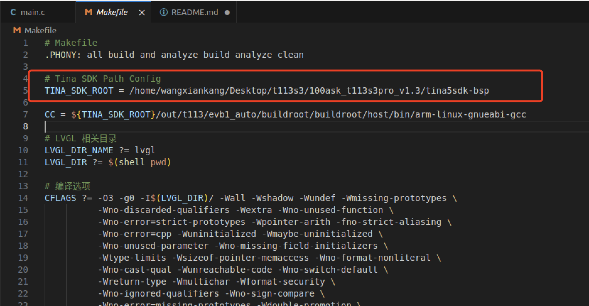
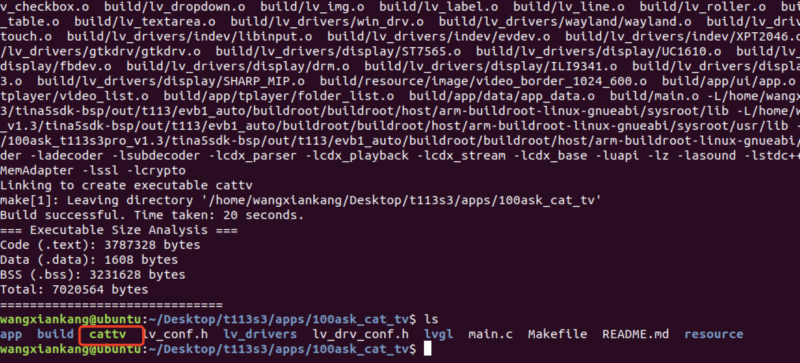

# LVGL从零实现一个多媒体播放器

## 前置条件

+ 硬件
    - 百问网T113S3-V1.3开发板
    - 百问网7寸RGB屏幕
    - 3.5mm耳机或功放扬声器套件
    - 12V锂电池或12V电源适配器
+ 软件
    - 参考100ask官方文档[开发环境搭建 | 东山Π](https://docs.100ask.net/dshanpi/docs/T113s3-Pro/part3/DevelopmentEnvironmentSetup/)完成开发环境搭建并完成tina5sdk编译打包烧录
+ 源码：
    + 仓库地址： https://github.com/DongshanPI/100ASK_T113s3-SdNand_TinaSDK5/tree/pj-100ask_cat_tv
    + 作者原始仓库：https://gitee.com/wangxiankang/t113s3_cattv_demo


## 实现原理
基于lvgl+tplayer库实现，tplayer为全志tinasdk内置，lvgl参考100ask官方进行移植和修改，tplayer负责解码播放sd卡内的mp4文件播放，lvgl负责UI交互，lvgl图层位于tplayer图层之上并将lvgl中心设置透明窗口用于显示tplayer播放内容。

## 编译项目
修改cat_tv项目顶层makefile的TINA_SDK_ROOT环境变量为你tina5sdk的所在位置，如下：

```bash
git clone  https://github.com/DongshanPI/100ASK_T113s3-SdNand_TinaSDK5/ -b pj-100ask_cat_tv
cd 100ASK_T113s3-SdNand_TinaSDK5
```

之后编辑 内置的Makefile 修改交叉编译器位置，注意需要先 编译过 Tina5SDK 系统镜像，才可以继续后续操作。



在cat_tv项目顶层目录下打开终端，执行make -j32完成对cat_tv项目编译，编译成功输出如下：



## 运行测试
sd卡预存一些mp4文件并将sd卡插入开发板，上电开机，通过adb将cattv可执行程序上传至开发板，如下：

```c
# 设置开发板音频属性
amixer -D hw:audiocodec cset numid=39 1
amixer -D hw:audiocodec cset numid=38 1

# 上传cattv程序到开发板
adb push cattv /mnt/UDISK

# 给予可执行程序(开发板端)
chmod +x cattv

# 执行测试
./ cattv

# 补充
sd卡的目录结构为(每套视频都有一个目录存放)：
tom&jerry/001.mp4、tom&jerry/999.mp4
xiyangyang/001.mp4、xiyangyang/999.mp4
```

# 开机自启
修改/etc/profile文件，在文件尾部添加如下内容：

```c
amixer -D hw:audiocodec cset numid=39 1
amixer -D hw:audiocodec cset numid=38 1

cd /mnt/UDISK
chmod +x cattv
./ cattv > /dev/null &
cd /
```

